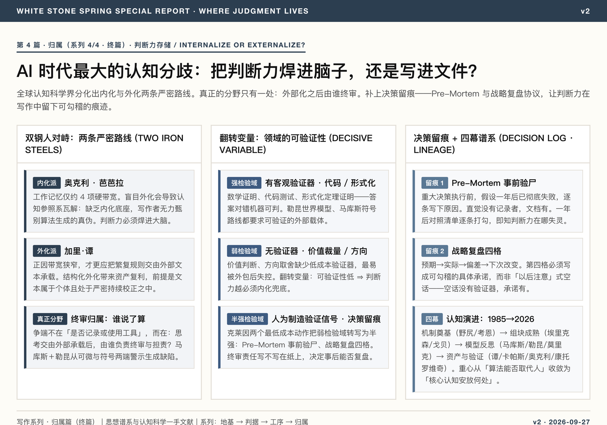

<figure class="card-preview-frame">
  <div class="card-img-wrap">
    <a href="../assets/AI认知判断力_卡片图.html" target="_blank" title="Click to open the full-screen, high-resolution vector image">
      
    </a>
  </div>
</figure>

---

## Introduction: A Universal Workplace Moment

> **Writing Series, Part 4 · Attribution (the final part).** The series' theme: using writing to learn and develop yourself. Part 1 established the input-side strata, Part 2 the output-side criteria, Part 3 the three processes that turn other people's words into your own judgment; this part closes the loop — where judgment should be welded, into the brain (internalized) or into files (externalized). How the four hang together is explained in Part 3.

Within seconds, an AI has produced a seemingly complete business plan. You took it on faith, without a second thought.

Months later, when the team asks you to make an independent call on a similar matter, you find you cannot explain the reasoning behind any of the choices.

This is not a simple "should we use the tool" debate; it is the deeper **question of where to place your cognitive assets**. Over the past several years, global cognitive scientists and frontier practitioners have crystallized into two sharply opposed, yet internally rigorous, camps. Both sides hold first-hand experience and solid empirical evidence. This article pulls the threads apart, juxtaposes the strongest arguments of each camp, and clarifies the underlying mechanism that actually determines where they diverge.

---

## The First Camp: Judgment Must Be Internalized into the Brain

**Leading figure: Barbara Oakley**

Oakley has spent decades studying the mechanics of learning and engineering education, and is the author of *A Mind for Numbers*. In a dedicated session at the 2026 International Congress on Mathematical Education (ICM), she put it plainly:

> "AI shows, but you're the one who has to know."

The foundation of Oakley's argument is not moral exhortation but the brain's actual neural machinery. The human brain runs two memory systems with distinct jobs: **declarative memory**, hippocampal-led (slow to retrieve, effortful to access, and can be stated explicitly), and **procedural memory**, striatal-led (runs automatically, responds quickly, and is buried deep in intuition). For a skill to truly settle in, it must pass through the complete neurodevelopmental cycle of deliberate practice, overlearning, and compressive refinement.

There is no shortcut around this physiological compression. When algorithms carry the entire process, the learner's brain skips the necessary refinement circuits and ends up in the predicament of **skill suspension ("never-skilling")**: cognition stays parked at the surface of "seeming to understand" and never crosses into the deep water of independent practice.

The scholars behind this camp form a solid chain of cognitive-science evidence:

- **Nelson Cowan (2001)** revised Miller's famous "7±2" hypothesis: rigorous attention-breadth experiments show that the hard bandwidth of human central working memory is only about **4 chunks**, and it cannot be expanded through later training. The physiological channel through which humans process complex information is intrinsically narrow.
- **Fernand Gobet's** CHREST cognitive architecture shows that so-called expert intuition is not some ungraspable flash of insight, but the automatic activation of highly organized structures in long-term memory — chunks and lookahead search trees. **The expert's edge lies in the density of the long-term memory store, not in momentary computing power.**
- **K. Anders Ericsson's** 25-year empirical review of expert performance shows that excellence is, at bottom, a long-term chunk network deposited through massive amounts of deliberate practice.

From this chain, the first camp's core claim follows: **the more powerful the tool, the more fragile the untrained individual becomes.** Fluent algorithmic output easily triggers the "I've already got it" cognitive illusion; and the only answer to a bandwidth-limited brain is to patiently compress core judgment into long-term memory, rather than throwing it outward.

---

## The Second Camp: Cognition Must Be Externalized into Controlled Knowledge Assets

**Leading figures: Garry Tan and Andrej Karpathy**

Speaking at Y Combinator's startup school about "personal AGI," Garry Tan proposed:

> "Own your skill files, or your job becomes a skill file."

This camp's claim is that in the age of large language models, the strategic lever has moved from the model's underlying weights to the context the practitioner supplies — that is, the individual's accumulated prompting strategies, business workflows, discriminating criteria, and canonical cases. Only when this thinking is formalized into version-controlled plain-text files and revised continuously can an individual's cognitive assets truly compound. Without actively recording and owning this knowledge, an individual is in substance merely renting external compute.

This lineage traces back to Paul Graham's writing philosophy: clarifying muddled thinking by writing clearly — the sedimentation of text is itself the process of cognitive growth.

The computer scientist Karpathy reinforces this camp from the systems-architecture level. He lays out software engineering's evolution from 1.0 (hand-written rules and code) to 2.0 (data-driven optimization of model weights) to 3.0 (natural language directing model generation). In this framing, the professional's core duty shifts to the architectural design of "context engineering." Confronted with the model's jagged, irregular capability frontier, the human's duty is to be a rigorous conductor.

The second camp's core claim crystallizes accordingly: **the more powerful the tool, the more effective externalized knowledge assets become.** Since the human brain's working bandwidth holds only about 4 items, scarce physiological bandwidth should not be spent on rote memorization and mechanical lookup. Outsourcing cognition into document assets that are executable, shareable, and iterable — with humans focused on judging and directing — is not just engineering-sensible; it builds a durable compounding asset that outlasts bodily memory.

---

## The Real Divergence: Who Has the Final Say After Externalization

Taken at the theoretical level, the two camps hold no irreconcilable empirical contradiction. Oakley insists that because brain bandwidth is narrow, everything must be ruthlessly compressed; Tan argues that precisely because bandwidth is narrow, complex rules belong in external text. They are each the other's premise.

**The only true fault line is this: the final ownership of judgment, and the mechanism by which cognitive conclusions are verified.**

- What Oakley fears: wholesale externalization collapses the cognitive reference frame. Without an internalized knowledge base, the writer cannot discriminate the true from the false in algorithmic output;
- What Tan emphasizes: structured externalization compounds into an asset, provided the texts belong to the individual and remain under rigorous, continuous revision.

This shows the dispute is not "should we record or use tools"; it is: **once thinking is carried externally, who bears final review and responsibility?**

Around this focus, the scholars offer further sub-dimensions:

Ethan Mollick proposes a **three-way rule for tasks**:
- **Fully internalized tasks** ("Just Me"): value judgments and ethical calls that only a human can bear;
- **Collaborative delegations** ("Delegated"): the algorithm drafts, while a human checks every step against internalized standards;
- **Fully automated tasks** ("Automated"): routine steps with clear boundaries that machines can run end-to-end.

Gary Marcus and Yann LeCun raise alarms from the underlying technical routes. Marcus continues to argue for the necessity of combining symbolic systems with neural ones, warning of the hallucination risks of purely probabilistic generation; LeCun champions the world-model route and points out the physical defects of autoregressive large language models in commonsense reasoning.

Looking back at the history of ideas, Japanese scholar Hideo Nogiri wrote in Chapter Two of *The Age of the Brain* (*Nō no Jidai*), published in 1985, that the progressive outsourcing of human cognitive functions to external media — from oracle bones and bamboo slips to paper and code — is the necessary structure of civilizational evolution. The century-scale question he left behind remains open to this day: **the issue was never whether to offload cognition, but where the offloaded knowledge assets reside, and who governs them.**

---

## The Decisive Variable: Domain Verifiability

Squaring the theoretical threads above, exactly one variable resolves the confrontation between the two camps: **whether the task at hand comes with an objective, low-cost verifier.**

Two paradigm cases from recent years:

- **Skills written as text**: externalizing experience into readable procedures is useful, but if the upstream judgment is off, nothing auto-corrects — the bias merely gets amplified. This is a **weak-verification environment**;
- **Proof-as-code**: as mathematician Alex Kontorovich advocates with Lean's interactive theorem proving, the formal system's grammar acts as an impartial referee — any gap in logic fails to compile. This is a **strong-verification environment**.

With **verifiability** on the horizontal axis, the map of knowledge practice becomes plain:

| Domain of practice | Verifier strength | Decision mechanism | Optimal strategy |
|:---|:---:|:---|:---|
| **Formal mathematics, software testing, tasks with clear truth values** | **Strong** | Compilers and automated tests decide right from wrong outright | **Externalize aggressively**, maximizing the use of compute |
| **Prose writing, plan design, analyses with evaluation criteria** | **Medium** | Depends on expert human review; re-verification is expensive | **Externalize carefully, retaining rigorous human review** |
| **Values, meaning-making, final accountability** | **None** | No objective testing algorithm exists; the agent alone must decide | **Internalize firmly in the brain**; hollow outsourcing is forbidden |

The essence of the intellectual dispute, it turns out, is not a sides-election between "internalizers" and "externalizers," but the demarcation between strong-verification domains and weak-verification ones. In domains with hard verification, algorithmic labor can unlock enormous productivity; but in domains without objective measures, if you surrender internalized aesthetic, ethical, and logical intuition, what externalization compounds is mediocrity and error.

---

## The Lineage at a Glance: Four Acts of Cognitive Evolution

```
1985 ─────── 2001 ─────── 2006 ─────── 2012 ─────── 2017 ─────── 2024 ─────── 2026
  │            │            │            │            │            │            │
机制奠基     机制奠基     专家机制     专家机制     模型崛起     模型反思     资产与验证
野尻 (1985)  考恩 (2001)  埃里克森     戈贝         Transformer  马库斯       谭 · 卡帕斯
脑的时代     4项硬带宽    刻意练习     组块网络     生成路线     收益递减     勒昆世界模型
             (修正米勒)                (CHREST)                  莫里克锯齿   康托罗维奇
                                                                              代码化定理
```

1. **Act I (1985–2001): Foundations in the Physiology of Cognition**  
   Nogiri established the evolutionary framework of cognitive externalization; Miller's "7±2" hypothesis was empirically sharpened by Cowan to "central working memory holds only about 4 items," fixing the upper bound of the human brain's physiological bandwidth.
2. **Act II (2006–2012): Maturation of the Experts' Chunk Theory**  
   Ericsson's empirical review confirmed the theory of deliberate practice; Gobet's computational models established that chunk hierarchies in long-term memory are the source of intuition, securing the irreplaceable status of the "internalized knowledge base."
3. **Act III (2017–2024): The LLM Rush and Reflection at the Boundaries**  
   Generative AI swept the globe; Marcus and LeCun, from the differentiable and symbolic sides respectively, criticized the defects of pure probabilistic generation; Mollick mapped the jagged frontier of tool capability.
4. **Act IV (2025–present): Assetization and Convergence on Verifiability**  
   Tan proposed the assetization of skill files; Karpathy advanced software engineering 3.0; Oakley raised alarm over learning atrophy; and formal theorem proving in code set a hard acceptance gate for externalized thought. The center of gravity of human inquiry has shifted, from "can algorithms replace people?" to "where does core cognition reside, and who holds final review?"

---

## Decision Logging: Writing Judgment into the Process, Not Just the Answer

The three lines of argument above converge on where core cognition resides and who holds final review. But for a writer there is a more everyday scenario: **the decision itself**. Judgment shows up not only in the final review of AI output, but in every choice — and a choice whose trade-off reasoning was not written down at the time leaves the later self with nothing to review.

Gary Klein (2007) designed two minimum-cost actions for such logging, both of which require writing **before the outcome is revealed**:

1. **Pre-Mortem**: before executing a major decision, assume that "one year from now this decision has failed completely," and write out an itemized list of reasons why. It converts prospective judgment from an intuitive act into a documentary act — intuition has no recorder, documents do. The list of failure reasons is simultaneously the verification signal to be checked afterward: a year later, tick through the list item by item, and you know exactly where the original judgment failed.
2. **Strategic review protocol**: once the outcome is revealed, write four cells — what was expected → what actually happened → where the deviation lies → what changes next time. The fourth cell is the key: **"what changes next time" must be written as a specific commitment that can be reconciled item by item in the future**, not as an empty phrase like "be more careful next time." Empty phrases have no verifier; reconcilable commitments do.

These two actions transcribe the **weak-verification domains** discussed in the section on the decisive variable (value judgments, directional choices, which inherently lack a low-cost verifier) into **semi-strong verification domains**: the verification signal is manufactured by hand, but once written into a document and once time has passed, the act of comparison becomes objective. The question of where judgment resides therefore acquires a concrete form in the decision scenario — **whether final-review responsibility is written on paper determines whether the decision can be reviewed afterward; only reviewable judgment can be said to grow, and unreviewable judgment is merely consumption.**

| Action | Timing | What is written | Verifier |
|:---|:---|:---|:---|
| Pre-Mortem | Before executing the decision | Itemized reasons under the assumption of failure | Item-by-item tick-through one year later |
| Strategic review | After the outcome is revealed | Four cells: expected / actual / deviation / what changes next | "What changes next" can be reconciled by a future review |

---

## The Writer's Three-Item Self-Check

No need to recite jargon. Before each time you open an AI for writing or analysis, run through the following three questions in order:

1. **Is there an objective verifier for the current task?**  
   If the code can pass unit tests and the conclusions can be falsified by logical theorem, let the tool go as far as it wants;
2. **If no off-the-shelf verifier exists, who is responsible for verification?**  
   If you carry final-review responsibility, the aesthetic standards and factual common sense needed to judge a draft must be established in advance, independently of the tool;
3. **Who ultimately owns the thinking that has been deposited?**  
   If the output merely scatters through a platform's ephemeral conversation stream, knowledge has not actually been retained. Only text that has been read by a human, refined, and lodged in a version-controlled repository belongs to the writer's own cognitive asset base.

---

## Series Navigation

This is **Part 4 · Attribution** of the *Writing Series*, and the final part. The series has four: foundation / criterion / process / attribution. How the four hang together, and the three processes themselves, are explained in Part 3.

Previous: [Writing Is Where Learning Happens](写作是学习的发生地_意外连接与开发自己的三道工序.html) (Part 3 · The Process) · This is the final part of the series.


## References and Citation Sources

### I. Cognitive Science and the Physiological Machinery
[1] COWAN N. The magical number 4 in short-term memory: A reconsideration of mental storage capacity[J]. Behavioral and Brain Sciences, 2001, 24(1): 87-114.  
[2] GOBET F, SIMON H A. Five seconds or sixty? Presentation time in chess memory[J]. Cognitive Science, 2000, 24(4): 651-682.  
[3] ERICSSON K A. The Influence of Experience and Deliberate Practice on the Development of Superior Expert Performance[M]//The Cambridge Handbook of Expertise and Expert Performance. Cambridge: Cambridge University Press, 2006: 683-703.  
[4] 野尻英孝. 脳の時代: 情報化社会と人間の未来[M]. 東京: 日本放送出版協会, 1985: 第二章.  
[5] OAKLEY B. AI in Mathematics Education: Keynote Address at the 15th International Congress on Mathematical Education (ICME-15)[C]. Sydney, 2026.  

### II. Artificial Intelligence, Software Engineering, and Frontier Discourse
[6] TAN G. Personal AGI and the Value of Private Skill Repositories[EB/OL]. YC Startup School, 2026.  
[7] KARPATHY A. Software 3.0: Programming in the Era of Large Language Models and Jagged Frontiers[EB/OL]. 2025.  
[8] MOLLICK E. Co-Intelligence: Living and Working with AI[M]. New York: Portfolio/Penguin, 2024.  
[9] MARCUS G. The Next Decades in AI: Four Steps Towards Robust Artificial Intelligence[J/OL]. arXiv preprint arXiv:2002.06177, 2020.  
[10] LECUN Y. A Path Towards Autonomous Machine Intelligence[J/OL]. OpenReview, 2022.  
[11] KONTOROVICH A. The Shape of Math To Come: Interactive Theorem Provers and Mathematical Discovery[J/OL]. arXiv preprint arXiv:2510.15924, 2025.
