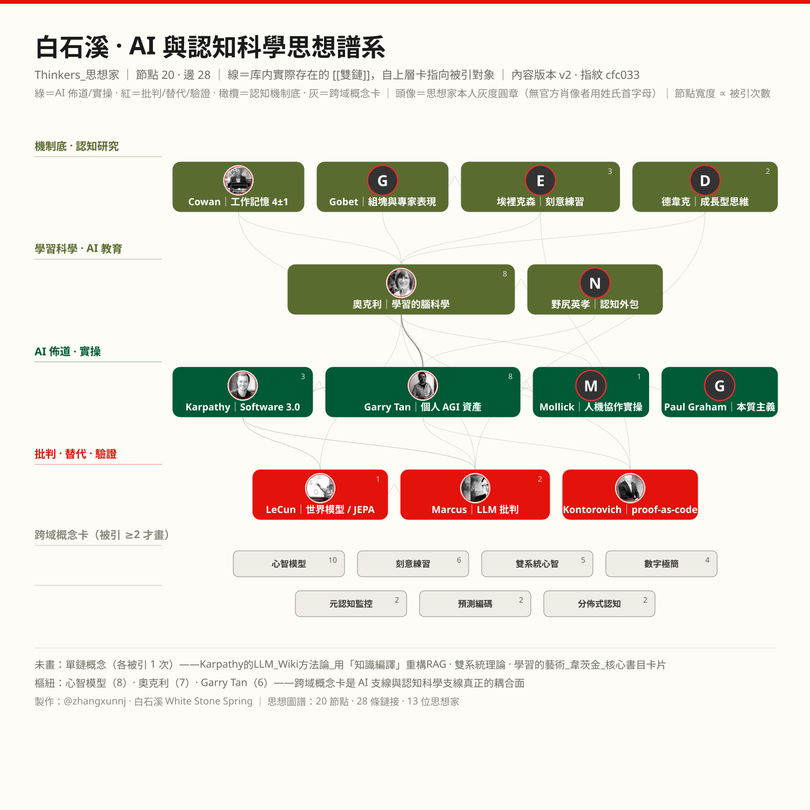

<figure>
  
  <figcaption>题图 · 白石溪 AI 与认知思想家谱系图（20 节点 · 28 条理论链接 · 13 位全球核心思想家）｜ 制图：@zhangxunnj</figcaption>
</figure>

---

## 一个所有人都遇到过的瞬间

AI 三秒给你一份看起来没问题的方案。你点了采纳。

三个月后，公司要你独立判断一个同类问题——你发现自己说不出为什么。

这不是"用不用 AI"的问题，是**判断力到底放哪的问题**。围绕它，过去两年全球最清醒的一批人分成了两条路线，各自都有硬证据、硬逻辑。这篇把两条最强版本都摆出来，最后点破：它们真正的分歧不在表面上，而在那个决定输赢的东西。

---

## 第一条路线：判断力必须焊进脑子

**最强代表：芭芭拉·奥克利（Barbara Oakley）**

奥克利写《学习之道》，是脑科学教育领域最有分量的人之一。2026 年 7 月，她在 ICM（国际数学教育大会）的 AI 教育专题上说了一句被反复引用的话：

> **"AI shows, but you're the one who has to know."**（AI 可以演示，但必须知道的是你。）

她不从道德劝诫入手，而是讲脑子里的硬机制：大脑有两条通路——海马体的**声明式记忆**（慢、费劲、可复述）和纹状体的**程序性记忆**（快、自动化、说不出来）。技能的沉淀路径是"刻意练习 → 过度学习 → 压缩成直觉"。这条路径**没有捷径**。AI 全程代劳，等于跳过压缩步骤，结果是**never-skilling**：你永远停在"看得懂"的层面，拿不到"做得出"的层次。

撑这条路线的不是她一个人，底下是一整层认知科学的硬研究：

- **Nelson Cowan（2001）**把 Miller 著名的"7±2"砍到**中央工作记忆容量约 4 个硬项**——而且练不大。注意：Cowan 不是说 Miller 错了，而是说 7±2 里的"chunk"是修辞，严格边界下你只有 4 个位置。**人脑的带宽比你以为的窄得多**。
- **Fernand Gobet** 的 CHREST 模型进一步说明：专家的"直觉"不是玄学，而是长期记忆里检索结构（组块+前瞻树）的自动激活——**专家强在库，不强在算力**。
- **安德斯·埃里克森**25 年综述的结论是同一件事的推论：专家 = 练出来的组块库。

所以第一条路线的钢人版本一句话：**AI 越强，你越危险**。因为它让你误以为"我懂了"，而机制上你并没有。人脑带宽只有 4 项，唯一的应对是把关键判断压缩进长期记忆，而不是交给外部。

---

## 第二条路线：认知应该写成你自己拥有的文件

**最强代表：Garry Tan（Y Combinator 总裁）+ Andrej Karpathy（OpenAI 创始成员、前特斯拉 AI 总监）**

2026 年 8 月，Garry Tan 在 YC Startup School 讲了一场"个人 AGI"（Personal AGI）。他的主张很具体：

> **"Own your skill files, or your job becomes a skill file."**（要么你拥有你的技能文件，要么你的工作本身会变成别人的技能文件。）

他的论证是：LLM 时代，**杠杆已经不在模型权重里，而在 context 里**——也就是你喂给模型的、属于你的那套提示词、流程、判断标准、历史案例。把它们写成 markdown 丢进自己的 repo，天天改，这就是"认知资产"在利滚利。不写下来、不拥有，你就只是在租别人的智能。

（这条线还能往前追到 **Paul Graham**：他讲"do things that don't scale"、讲"先想透再写"，本质是一回事的另一面——**把想不清的东西想清楚，这本身就是资产在长**。）

Karpathy 从另一个角度补上了机制的支撑。他提出 **Software 1.0 → 2.0 → 3.0**：1.0 是人写代码，2.0 是数据训练出权重，3.0 是**直接用自然语言编程模型**——程序员的角色变成"给模型写上下文"。他的原话里有一组关键词：ghosts（幽灵）、jagged（锯齿状能力边界）、context engineering（上下文工程）。

第二条路线的钢人版本因此是：**AI 越强，外部化越划算**。既然人脑只有 4 项带宽，为什么要把有限带宽浪费在记忆和检索上？把认知搬进文件，人脑只留一个"导演"的位置。而这套东西是**能攒、能传、能利滚利**的——比脑子靠得住。

---

## 两条路线都不弱，所以真正的分歧在哪？

关键先说破：**两条路线在事实层面根本不冲突。**

奥克利说"人脑带宽窄、技能要压缩"，Tan 说"那就把认知写到外部"。这两个陈述可以同时为真——它们甚至互为前提。Tan 之所以能主张"外部化"，正是因为预期了人脑带宽的稀缺。

真正的分歧点只有一个：**判断力的最终归属，和它的验证机制。**

- 奥克利担心的是：外部化会让你**失去判断的参照系**——你没法再分辨 AI 给的答案是对是错，因为你没有"know"。
- Tan 主张的是：外部化能让你**获得复利**——只要这套文件是你的、你能改、你能迭代。

两者能同时成立，恰恰说明分歧不在"要不要外部化"，而在：**外部化之后，谁来兜底？**

于是第二条线又分出一个更细的分支：

**Ethan Mollick（沃顿商学院）** 的贡献是拒绝二元。他给出**任务三分法**：Just Me（只能我做，如价值判断）/ Delegated（交给 AI 但我核对）/ Automated（完全可以自动化）。他的观察是 LLM 能力是**锯齿状的**——同样的模型，有的任务超人，相邻任务不及格。所以他主张：**不是选边，是按任务切**。他的另一句关键表述是 "the effort is the point"——省力不是目标，**把功夫花在正确的地方**才是。

**Gary Marcus** 和 **Yann LeCun** 从架构侧夹住了这条线。Marcus 从 2001 年就在预警 LLM 的根本缺陷，2022 年预言"收益递减"、2024 年被部分坐实；他主张混合智能（neurosymbolic）。LeCun 则坚持世界模型（JEPA）路线，认为纯 LLM 走不通——他 2026 年离开 Meta 另办实验室。**顺带说清：这俩人虽然都反 scaling，但给的是两个不同答案（符号派 vs 全可微派），不是一伙的"反 LLM 派"。**

再往前推 40 年，**野尻英孝** 在 1985 年的《脑的时代》里已经把这个问题放在文明尺度上：认知职能逐层外包给外部介质（龟甲→纸→代码），这不是个体事故，而是**文明结构**。他留下一个至今没有答案的问题：**关键不在要不要卸载，而在卸载到哪里、归谁所有。**（见野尻英孝 1985 年日文原著第二章）

---

## 翻转变量：可验证性

把上面所有线拧到一起，真正决定输赢的只有一个：**你手上有没有验证器。**

看 2026 年出现的两个案例：

- **Garry Tan 的 skill 文件**：判断被外化成可执行的文本。这是**弱担保**——文件能跑，但如果判断本身错了，没有人会发现。
- **Alex Kontorovich 的 proof-as-code**：在 ICM 2026 的报告《The Shape of Math To Come》（arXiv 2510.15924）里，数学证明被写成 Lean 程序。这是**强担保**——错了，机器直接不通过。

这俩是**同一条线上的两级**，不是两个阵营。差别只在验证器有多硬。

这个变量直接给出结论：

| 领域 | 可验证性 | 结论 |
|---|---|---|
| 数学证明、可测的代码、有 ground truth 的任务 | **强**（机器可判对错） | **激进外部化**，越彻底越好 |
| 写作、方案、分析、有明确评价标准的产出 | **中**（人能核对但成本高） | 外部化 + **保留人工核对**（Mollick 的 Delegated） |
| 价值判断、意义建构、责任承担 | **无**（没有验证器） | **必须内化**，无法外包 |

所以真正的分野，不是"内化派对外部化派"，**而是"可验证对不可验证"**。在可验证域里，奥克利的担忧被验证器消解了——错了机器会拦住你。在不可验证域里，Tan 的复利逻辑失效了——没有验证器，复利的是错误。

**这也解释了为什么两条线的最强者能同时都对**：他们各自盯的是不同的地盘。

---

## 谱系全景：这条思想线是怎么长出来的

```
1985 ─ 2001 ─ 2006 ─ 2012 ─ 2017 ─ 2024 ─ 2026
  │      │      │      │      │      │      │
机制奠基  机制奠基  专家表现  专家表现  LLM崛起  LLM反扑  资产化·验证化
野尻1985 Cowan01  Ericsson Gobet    GPT路线  Marcus   Tan·Karpathy
脑的时代  4±1     刻意练习  组块      RAG/CoT  收益递减  LeCun出走
         (7±2→4)           (CHREST)           Mollick  Kontorovich
                                              锯齿边界  proof-as-code
```

**四阶段：**

1. **1985–2001 机制奠基**：野尻《脑的时代》提出认知外部化 → Miller 7±2 → Cowan 2001 把 7 砍成 4。
2. **2006–2012 专家表现**：埃里克森刻意练习 25 年综述 + Gobet 组块机制 → "专家 = 练出来的组块库"成为定论。
3. **2017–2024 LLM 崛起与反扑**：GPT 路线 → 2022 收益递减（Marcus 预警）→ 锯齿边界（Mollick）→ 内化派警报（Oakley，2026）。
4. **2025–2026 资产化与验证化**：Personal AGI（Tan）→ Software 3.0（Karpathy）→ 世界模型出走（LeCun）→ proof-as-code（Kontorovich）。**主线问题从"AI 能不能"，变成了"认知资产归谁、放哪、怎么验"。**

---

## 给读者的三个自检问题

结论不用背，记这三个问题就行，下次开 AI 前过一遍：

1. **这件事有验证器吗？** 有（能跑测试、能证伪、有 ground truth）→ 放心交给 AI，甚至让它自动迭代。
2. **没有验证器的话，谁来核对？** 如果是你核对——那你核对所需的判断力，**必须在 AI 之外先建立**。这正是奥克利说的"know"。
3. **这份产出归谁？** 如果它只躺在某段聊天记录、某个平台里，那就不是你的。写成文件、进你自己的 repo、能传下去——这才是 Tan 说的"own"。

---

*本文理论与文献来源：涵盖 Barbara Oakley（学习科学）、Garry Tan（Personal AGI）、Andrej Karpathy（Software 3.0）、Paul Graham（写作与思考）、Ethan Mollick（任务三分法）、Gary Marcus（符号反思）、Yann LeCun（世界模型）、野尻英孝（外部化演进）、Nelson Cowan（工作记忆带宽）、Fernand Gobet（CHREST组块模型）、Alex Kontorovich（代码化证明）等十余位跨领域学者的一手文献。*
