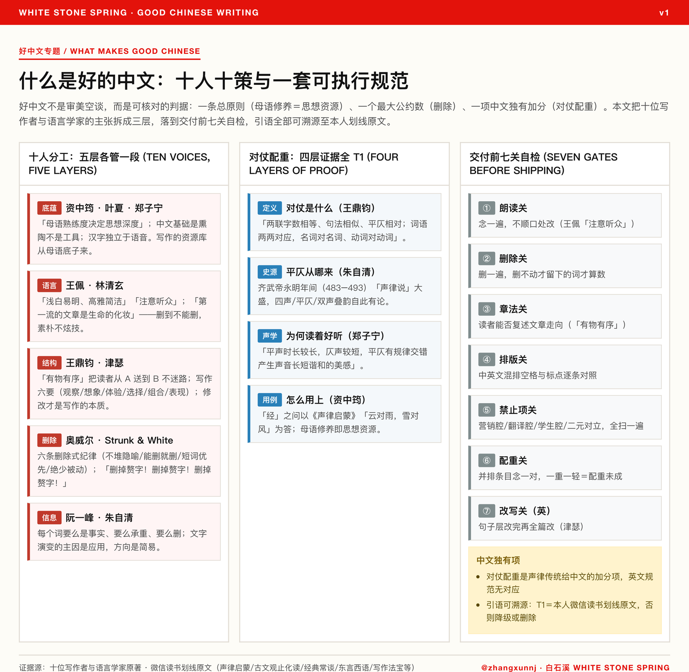

<figure>
  
  <figcaption>题图 · 经济学人风方法论卡（点击查看纯 HTML 矢量版）｜ 制图：@zhangxunnj</figcaption>
</figure>

---

## 引言：好中文不是风格，是可核对的判据

“什么是好的中文”这个问题，最容易滑向两个陷阱：一是美学空谈（“要有文采”），二是规范堆砌（一百条排版细节）。两者都回答不了写作者真正的问题——**我写完这段文字，怎么判断它是好的？**

本文不给审美答案，给可执行的判据。这些判据不是凭空立起来的：它们从十位写作者、语言学家的主张里提取，再逐条落到「检验动作」上——每个标准都能被念出来、删一遍、并排念一对。全文依据的两套规范（《好中文内容与排版规范》《英文写作与排版规范》）与十张人物卡片，全部入库可查。

先给结论，三句话：

1. **总原则只有一条**：母语修养就是思想资源。一个人的思想深度，与他对母语的熟练程度息息相关（资中筠，原话）。词库、语汇、联想，都从母语底子来。以下所有技巧，都是这条原则在执行层的展开。
2. **好文字是删出来的**：能删就删，删不动才留下的词才是承重墙（林清玄「第一流的文章是生命的化妆」；奥威尔「If it is possible to cut a word, always cut it」）。
3. **中文有独有加分项**：对仗配重——并排的两条念起来不能一重一轻。这是声律传统给中文写作留下的遗产，英文写作规范里没有对应物。

---

## 一、十人十策：同一条命脉上的十个支点

把十位写作者/语言学家按「他们回答的是好中文的哪一层」摆开，能看见一张没有重叠的分工图：

| # | 人物 | 回答的层 | 核心主张（原话/原书依据） | 证据级 |
|---|------|---------|--------------------------|--------|
| 1 | **资中筠** | 总原则 | 「一个人的思想深度，与他对母语的熟练程度息息相关」；中文基础是熏陶，不是工具 | T1（用户 读书 App《声律启蒙》点评） |
| 2 | **王佩** | 语言层 | 「浅白易明、高雅简洁」；「注意听众而非读者」——写完念一遍，念不顺就是坏句 | T1（冷库原文） |
| 3 | **王鼎钧** | 结构层 | 「有物有序」：把读者从 A 送到 B 不迷路；直叙最难；写作六要（观察、想象、体验、选择、组合、表现） | T1（读书 App《古文观止化读》19 划线） |
| 4 | **林清玄** | 删除纪律 | 「第一流的文章是生命的化妆」——删到不能删；素朴不炫技 | T2（文集归纳） |
| 5 | **阮一峰** | 信息密度 | 每个词要么是事实、要么承重、要么删；数字与来源优先于形容词 | T3（体例观察） |
| 6 | **朱自清** | 学理层 | 文字演变「主因是应用，方向是简易」；永明年间（483–493）「声律说」大盛，平仄自此有论 | T1（读书 App《经典常谈》26 划线） |
| 7 | **郑子宁** | 声学层 | 平声时长较长、仄声较短，平仄交错产生声音长短的谐和；汉字独立于语音 | T1（读书 App《东言西语》11 划线） |
| 8 | **叶圣陶·夏丏尊** | 教学层 | 作文是使用本国语文的初阶；《文心》故事化国文课 | T1（读书 App 94% 进度） |
| 9 | **奥威尔** | 删除式纪律（英） | 六条：不堆隐喻、能删就删、短词优先、绝少被动、常用词优先、为破粗俗可破上面任一条 | T1（王烁译全文） |
| 10 | **津瑟** | 修改工序（英） | 「修改才是写作的本质所在」；能流利写不等于写得好；写作是技能不是艺术 | T1（读书 App《写作法宝》10 划线） |

两条读法：

- **删字是最大公约数**。林清玄、奥威尔、津瑟、Strunk & White（「删掉赘字！删掉赘字！删掉赘字！」）四个互不通气的体系，收敛到同一个动作。它不是某家的风格主张，是写作的物理定律。
- **中西分工清晰**。中文一侧的四层（底蕴→语言→结构→声律）里，只有声律层没有西方对应物；英文一侧的删除式纪律与修改工序，可以整包搬到中文输出上——删除不挑语言。

---

## 二、对仗配重：中文独有的结构加分项，四层证据全 T1

「云对雨，雪对风，晚照对晴空」——这是《声律启蒙》里最入门的一段。资中筠把它当成「经」之问的答案：中文的底蕴，一半就藏在这类声律例里。但好的规范不能只停在「讲究对称」一句，要可检验。这条检验项是四层证据叠出来的，每一层都有独立出处：

| 层 | 回答什么 | 出处 | 证据 |
|----|---------|------|------|
| **定义** | 对仗是什么 | 王鼎钧《古文观止化读》 | 「文句分两联，上联与下联字数相等、句法相似、平仄相对；词语两两对应，名词对名词、动词对动词」 |
| **史源** | 平仄从哪来 | 朱自清《经典常谈》 | 齐武帝永明年间（483–493）「声律说」大盛，四声/平仄/双声叠韵自此有论 |
| **声学** | 为什么读起来好听 | 郑子宁《东言西语》 | 「平声时长较长，仄声较短，平仄有规律地交错会产生声音长短谐和的美感」 |
| **用例** | 怎么落到写作上 | 资中筠「经」之问 | 声律对例作「经」的答案；母语修养即思想资源 |

四层拼起来，检验动作才成立：**并排的两条（标题、并列论点、报告小标题）念出来，一重一轻？轻重失衡＝配重未成。** 比如「市场规模与客户痛点」对一个「增长路径」——前二项各带修饰、后一项光杆，念起来头重脚轻，就是要补的信号。

学术上这是把骈体传统收编进章法；操作上它只占自检的一行。英文写作规范明确不做这一项：英文只有 front-load（要点前置），没有配重——这是两套规范里少数的「中文独有」条款。

---

## 三、把主张变成工序：交付前七关

十人的主张如果只停在「要删、要短、要清楚」，等于没有主张。可执行的写法是把它排成过门顺序——写完不交，按序过七关：

1. **朗读关**：念一遍，不顺口处改（王佩「注意听众」）；
2. **删除关**：删一遍，删不动才留下的词才算数（林清玄/奥威尔/Strunk & White）；
3. **章法关**：读者能否复述文章走向（王鼎钧「有物有序」）；
4. **排版关**：中英文混排逐条对照（sparing/chinese-copywriting-guidelines 空格与标点表）；
5. **禁止项关**：营销腔（助力/赋能/打造）、翻译腔（「基于……我们必须强调的是」）、学生腔（综上所述）、二元对立句式、重复标点，全扫一遍；
6. **配重关**：并排条目念一对，轻重失衡就补（第二节）；
7. **改写关**（英文件）：句子层改完再全篇改（津瑟「修改才是写作的本质所在」）。

排版关的标准条目（全文表格见规范原文），最常被违反的四条：

| 规则 | 正例 | 反例 |
|------|------|------|
| 中英文之间加空格 | 在 LeanCloud 上 | 在LeanCloud上 |
| 数字与单位加空格 | 10 Gbps | 10Gbps |
| 度数/百分比**不**加空格 | 90°、15% | 90 °、15 % |
| 全角中文标点 | ，。！？；： | , . ! ? ; : |

---

## 四、证据纪律：为什么这篇敢引用原话

本文所有「原话」条目都标了证据级（T1/T2/T3）。T1 不是转引，是用户本人读书 App里的划线与点评——《声律启蒙》1 条点评（资中筠文全文）、《古文观止化读》19 条、《经典常谈》26 条、《东言西语》11 条、《写作法宝》10 条、《文心》94% 阅读进度。二手归纳的条目（林清玄、阮一峰）如实标 T2/T3，不做冒充。

这是写作规范本身应遵守的第一条：**引语可溯源，否则降级或删除。** 十张人物卡片与两套 SOP 的对应关系，库内全链互挂，任何一条判据都能沿着双链回到出处原文。

---

## 结语：好中文是删出来的，更是读出来的

十位写作者的路子看着各说各话，收拢起来只有两件事：**读**（母语底子决定思想资源，声律对仗是中文的独有红利）与**删**（跨语言的最大公约数）。技巧层的分歧（章法 vs 素朴 vs 信息密度）其实是同一个东西在不同文体上的投影——王鼎钧管「送到 B 不迷路」，林清玄管「别把读者淹死在辞藻里」，阮一峰管「每行字都要载货」。

下一波冲刷会带什么新腔进来（AI 文体的两极化见姊妹篇《翻译如何重塑中文》），本文不预测。它只做两件事：把判据立成可核对的工序，把出处钉到原文。判据可以随语料更新，但「念一遍、删一遍、并排念一对」这三个动作，二十年内不会过时。
