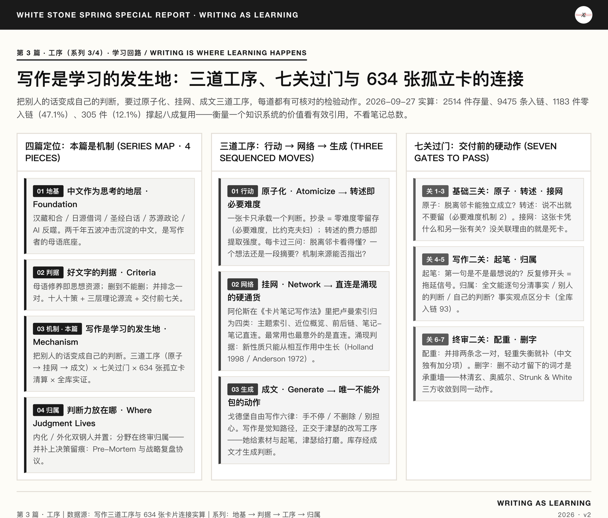

<figure class="card-preview-frame">
  

    
  

</figure>

> This is the third installment of the *Writing Series* (the mechanism piece: how to turn other people's words into your own judgment). The two preceding installments: *How Translation Has Reshaped Chinese* (linguistics · feature essay · Part 1) and *What Is Good Chinese* (writing methodology · standard · Part 2). This is the third of four installments. After this one comes Part 4, *The Two Steelmen of AI Cognitive Judgment* — the final piece, on where judgment should be welded: into the brain, or written into files. How the four hang together, and the three processes themselves, are explained in this piece.

---

## Introduction: A Person with 561 Books of Notes Who Cannot Write a Single Sentence of Their Own

Three-sentence conclusion, up front:

1. **Reading something in and learning it are two different things.** The ease you feel while highlighting is storage strength; you only find out whether you really understood when you try to retrieve it. The hurdle in between is called desirable difficulty — transcription is zero difficulty, and zero retention (the *Desirable Difficulty* card, T3, citing the Bjorks).
2. **Judgment does not grow out of the notes; it grows out of the collisions between notes.** A single card produces no insight; the way cards are connected determines what the system can bring into existence (the *Luhmann Index* card; emergence).
3. **Writing is the only step of these three processes that cannot be outsourced.** Search, summarization, and classification can all be handed to tools; only the step "put it into your own words in your own text" must be completed by the writer's hands and judgment (permanent notes; Ahrens, T1).

Let me fix the measurement basis first, so the numbers do not fight each other. My knowledge base carries two sets of statistics with different meanings:

| Basis | Number | Meaning | Source |
|-------|--------|---------|--------|
| Total knowledge files | 2,164 .md files | The full content collection (includes the 561 core framework book notes, chapters across commercial project plans, and industry research reference materials) | Script-computed 2026-09-27 |
| Files containing wikilinks | 1,680 (77.6%) | At least one bidirectional link | Same as above |
| Total bidirectional links | 13,382 | Average 6.2 per file | Same as above |
| Zero-inbound content files | 375 | Their own titles are never cited by anyone (includes book notes, MOCs, asset pages) | Same as above |
| Total cards / orphan notes | 1,992 / 634 | Card-method audit basis: counts D3 cards only; fewer than 2 links = orphan | *Orphan Notes MOC*, 2026-09-25 |

The two figures cannot substitute for one another: 2,164 counts content files, 1,992 counts cards. A card can have zero inbound links, and a book note can have zero inbound links, and the two situations mean completely different things.

The 634 orphan cards are the most concrete block of debt in this vault. They are not "unfinished" — they are "written but never connected." That is exactly what this article deals with.

**The special position of this installment**: The series has four installments in total; this one quotes the first two (input-side strata, output-side criteria), and the series itself is a living sample of these three processes in operation — the discussion in the four sections below uses the making of this series as a side-by-side specimen. After this article comes Part 4, *The Two Steelmen of AI Cognitive Judgment*, which answers "where judgment should be welded — into the brain, or written into files."

---

## I. The Gap Left by the First Two Installments

With the first two installments, the map has roughly taken shape:

| Installment | Question it answers | Which layer it sits on |
|-------------|--------------------|-------------------------|
| Part 1, *How Translation Has Reshaped Chinese* | How Chinese was shaped | The input-side strata |
| Part 2, *What Is Good Chinese* | After you finish, how do you judge it is good | The output-side criteria |
| **Part 3 (this article)** | **How to turn other people's words into your own judgment** | **The middle process** |
| Part 4, *The Two Steelmen of AI Cognitive Judgment* | Where judgment should live — welded into the brain, or written into files | The storage location |

Both earlier installments handle "the text" and "judgment" themselves; neither handles the **conversion act**. The conversion act is where learning actually happens: for the same book, there is a difference between reading it and closing it and having nothing left, and reading it and then being able to explain one of its mechanisms in your own words and having it change one of your decisions. The gap between those two outcomes is not memory — it is process.

After this article comes Part 4, *The Two Steelmen of AI Cognitive Judgment*, which closes out the question of "where judgment should live."

This gap has a corresponding artifact in the vault. The five steps of the *Cross-Domain Concept Mapping* card — concept extraction, isomorphism detection, metaphorical mapping, toolbox reuse, boundary annotation — form a complete conversion process, but it sits in the methodology folder, unconnected to the day-to-day reading-extraction pipeline. The daily pipeline is the extraction flow: highlight → extract → create card. The step between highlighting and card creation is the one this article fills in.

The series itself is a living sample of these three processes in operation. Each installment corresponds to one or more of them:

- **Part 1, *How Translation Has Reshaped Chinese*** — *a sample of successful weaving*: five streams that had nothing to do with one another (the *Analects*, the 1919 Union New Testament, Mao Zedong's writings, contemporary party-press prose, and the output of 5 major LLMs) get hung on a single "two-thousand-year, five-wave" net. The weaving settles in one pass; everything downstream is directly reusable.
- **Part 2, *What Is Good Chinese*** — *a sample of atomization and writing*: ten independent writers and linguists (each one an independent source of judgment) get broken into three layers, then turned into the "seven pre-delivery checks," each check a verifiable action.
- **Part 3 (this article)** — *a sample of correction after weaving fails*: the series was originally planned to run further; mid-draft it turned out that what had been assembled "wasn't a process — it was a label pasted onto a process." Cutting it back to four installments is itself an instance of "recognize false orphans, clean the stock, re-run the three processes."
- **Part 4, *The Two Steelmen of AI Cognitive Judgment*** — *a sample of writing-as-judgment-sealing*: keeping the two storage locations for judgment (in the head and in files) separate, and writing out clearly when a judgment should be internalized versus externalized — writing is not just output, it is nailing a judgment to a specific article so it does not drift with forgetting.

The four installments are therefore not "four independent topics"; they are one set of three processes run in different scenes: weaving, atomizing, writing, correcting, sealing. That layer of relationship is not repeated in the introductions of Parts 1, 2, and 4 — each of them stands on its own. Only this installment, as the mechanism installment, owes the reader the full accounting. The empirical reading in section "VI.5" below is run on this very stock — the series' own draft files are among the 2,514 items measured.

---

## II. The First Process: Atomization — Breaking a Book Down into a Single, Independently Reusable Judgment

The *Desirable Difficulty* card defines the concept precisely: human memory suffers from a metacognitive illusion, mistaking "I remembered it" for "I learned it." Memory looks limitless at write time, like a hard drive, but information competes for the same retrieval channels. Adding sensible difficulty at storage time (self-testing, spacing, re-explanation) slows short-term acquisition but makes long-term retrieval more solid — storage strength and retrieval strength are two separate curves (the *Desirable Difficulty* card, T3).

The implication for writing is direct: **transcribing a book creates zero desirable difficulty.** Carrying 24,259 highlights verbatim into note files yields retrieval strength close to zero, because the retrieval path is the copy path.

Atomization is the first process that fixes this. Of the four standards on the *Permanent Notes* card — atomized, self-sufficient, standard format, interlinked — atomization is the precondition: a card carries only one idea, so it can be reused at maximum range. This standard's operational definition is a check action, not an aphorism —

- Can this card stand on its own, readable without looking at any adjacent card?
- Does it state one idea, or is it a summary of a book?
- Next time I cite this judgment, can I say precisely which mechanism it comes from?

Pass all three, and the card enters the permanent zone. Fail any one, and it is just highlight-hauling.

Among the 561 core framework book notes, the thickest is *The Story of Psychology*: 1,453 lines, 66 sub-sections. Sixty-six sub-sections are not sixty-six cards; they are one big summary. The atomization check fails it outright.

---

## III. The Second Process: Weaving the Web — Connecting Two Cards That Should Not Be Related

What the *Luhmann Index* card records is Ahrens's distillation of Luhmann's card box: connection does not run on folder hierarchy, it runs on four kinds of index — subject index, proximate overview, chain links (before/after), and direct note-to-note links. The source text states explicitly that direct links "often produce unexpected new lines of thought (the most used kind)" (T3, citing the recommended preface to Ahrens, *How to Take Smart Notes*).

Of these four kinds, only one happens by surprise. The subject index is gathered together deliberately by the author; the proximate overview is an accident of physical position; the chain links are derived by logic — all of them happen, but all are predictable. Direct linking is not: any two cards can be joined, and the author does not know in advance what the connection will turn out to be.

The *Emergence* card supplies the theoretical base for this mechanism. Three tests: the new property cannot be deduced by a linear sum of individual properties; it can only grow out of interaction and cannot be directly designed in; once formed, it feeds back to constrain individual behavior. It is not mysticism — it is the necessary product of "local rules + scale + nonlinear feedback" (card cites Holland, *Emergence: From Chaos to Order*, 1998, and Anderson, "More Is Different," 1972; T2).

The card's own applied conclusion becomes this article's test: **measure a knowledge base's value by the number of effective bidirectional links, not by the total number of notes.**

Measured against the computed figures at the start of the introduction, "unexpected connection" lands from concept to metric. Currently: 13,382 bidirectional links, averaging 6.2 per file, 375 zero-inbound content files — the 6.2 average shows most cards are connected to a small neighborhood, while the 375 zero-inbound files show connection has not happened at all in some regions. The vault holds 561 core framework book notes, the vast majority of them plain-text containers: notes flow one-way into cards, and few connections run back from cards to notes.

Goldberg gives this mechanism a physiological-level explanation in *Writing Down the Bones: How an Ordinary Person Expresses Herself Through Writing* (T1 highlight): the senses themselves lack momentum; they receive experience, and then that experience must be shaken through the consciousness and the whole body in large sweeps before it can be winnowed out. She calls this "composting" — the body is the mind's compost heap: eggshells, spinach leaves, coffee grounds piled together to rot and break down, producing nitrogen, heat, and rich soil, from which poems and stories sprout and bear fruit.

This passage explains why connection cannot be accomplished by "tidying." Compost takes time, needs mixture, needs fermentation. Tidying does sorting and shelving — that is a different job; sorting makes material orderly, it does not make material react.

---

## IV. The Third Process: Writing It Up — Pulling Your Hands Off the Blank Page

Atomization fixes the quality of a single card; weaving fixes connection density. Neither can substitute for writing it up. The reason: the object of the first two processes is still other people's words; the object of writing it up is your own judgment at this moment.

The *Natalie Goldberg: Freewriting and Self-Expression* card quotes the central proposition: writing is a path of awareness and self-expression. The six laws of freewriting recorded in the card begin with "the hand must keep writing" — do not stop to reread the line you just wrote; that only buys time and tries to control what you are saying; the second law is "do not delete"; the third is "do not worry about spelling, punctuation, and grammar" (T1 highlight).

What this set of laws pushes back against is the urge to control, not revision. The card's positioning of the laws is accurate: they are orthogonal to *William Zinsser: Writing's Tools and Revision-Is-Writing* — Zinsser governs how to write well; Goldberg governs how to start and what to start with. She supplies the raw material and the opening; Zinsser supplies the polish.

So the check action for this process is not to inspect the prose; it is to inspect the start:

- Is the first sentence of this paragraph the one I most want to say?
- Have I, to make the sentence complete, pushed the real thought to later?
- After finishing, is there a sentence I would not dare sign my own name to?

The third is the hard check. The *Fact/Opinion Distillation* card is cited 93 times in the vault — one of the highest-inbound model cards of the whole system — and it governs exactly this: of what you have written, which sentences are facts and which are your judgments. If you cannot tell them apart, writing it up degrades into tidying.

---

## V. Arranging the Three Processes as a Deliverable Gate Sequence

If the three processes stop at "atomize, weave, write it up," they amount to no process at all. The executable version arranges them as a gate sequence: after writing, before delivery, pass the gates in order —

1. **Atom gate**: Can this paragraph stand on its own? Is it a judgment or a summary? (Against the three tests in Section II.)
2. **Paraphrase gate**: Can every judgment be put into your own words — if you cannot, do not keep it. A paraphrase failure usually signals a comprehension failure, not merely an expression one (desirable difficulty, mechanism 2: retrieval strength of active recall exceeds that of repeated reading).
3. **Link gate**: Does this card have at least one outbound link? On what grounds is it related to at least one other card? A card with no stated reason for its connections is a dead card once it enters the vault.
4. **Start gate**: Is the first sentence the one most worth saying? Have you been revising the opening over and over while writing (a procrastination signal)?
5. **Attribution gate**: Can the text's facts, others' judgments, and your own judgments be marked apart sentence by sentence? (The *Fact/Opinion Distillation* card, 93 inbound links across the vault.)
6. **Counterweight gate**: Read parallel items side by side; if the weight is off, fill it in (carrying over the check from Section II of *What Is Good Chinese* — antithetic counterweight, unique to Chinese; no counterpart in the English standards).
7. **Deletion gate**: Cut whatever can be cut; only the words that resist cutting are load-bearing walls (Lin Qingxuan, Orwell, and Strunk & White converge on the same action; see Section I of *What Is Good Chinese*).

Gate 5 is where this article and *What Is Good Chinese* part ways. That article's gate 5 is the layout gate, which governs form; this article's gate 5 is the attribution gate, which governs epistemology. The same sentence can be a description or it can be a judgment I passed off as a description; the difference between the two is not whether the Chinese is good — it is whether I have claimed it as my own.

---

## VI. The 634 Orphan Cards: A Liquidation of the Existing Stock

Landed onto the stock, this article's tests become a checklist that can be executed immediately.

Orphan cards fall into three classes by cause, and the handling of each class is completely different:

| Card class | Test | Action |
|------------|------|--------|
| Highlight-hauling | Content is mostly verbatim quotation, no independent judgment sentence | Take one independent judgment and rewrite; if it cannot be rewritten, cut it at the atom gate |
| Framework metadata | Content is process description, SOP record, status snapshot | Convert to a pointer line to the true source, so it stops competing with the true source for citations |
| Genuinely orphaned judgment | Has an independent judgment; what is missing is a neighbor | Run the link gate: find outbound links among the other cards on the same question |

The checklist is not generated on the spot in this article, because the reporting standard requires: read-only, survey the full picture first, finalize later. Current reading (audit basis of 2026-09-25): 1,992 cards, 634 orphans, 31.8%.

That proportion deserves a sentence of its own. It says more about a knowledge base's health than "how many cards" does — a third of all cards unconnected to the network means the system's emergent potential is locked inside single cards. Scholars of this kind of system have a word for the condition: local optima. Each card, examined alone, complies with the standard; taken together, they produce nothing.

The order of back-linking matters. Fix the genuinely orphaned judgments first (the moment those cards connect, they produce something new), then handle framework metadata (it does not touch knowledge density, only retrieval noise), and the haulers last — that batch is the largest workload for the lowest return, unless a judgment inside one of them is to be reused.

---

## VI.5 Empirical Reading: What These Processes Yield in a Real Library

The five sections above describe what ought to be done. This section reports the readings after running the same criteria against a real knowledge base — 2,514 items of existing stock (script-computed on 2026-09-27 from the full link graph). The numbers diverge sharply from intuition.

| Metric | Measured value | Reading |
|---------|---------------|---------|
| Total content items | 2,514 md files | Substantial stock |
| Total inbound links | 9,475 | Reuse exists, but distribution is extremely uneven |
| Zero inbound links (never referenced) | **1,183 (47.1%)** | Nearly half stored and never called upon |
| Files contributing 80% of compounding | **305 (12.1%)** | Pareto: 12% of files carry 80% of reuse |
| Genuinely inside the network (both inbound and outbound) | 1,002 (39.9%) | Less than four in ten |
| Core items referenced 6+ times | 293 (11.7%) | The part that is truly earning interest |

Cutting the library by "has outbound links × has inbound links" yields four shapes, whose contributions to compounding differ enormously:

- **Hub (1,002 items)** — cites others and is cited by others: the engine of compounding.
- **Dormant (859 items)** — cites others but is never itself cited. **This is the most regrettable class**: it had connections at entry, but no exit at delivery. The content may be good, yet it lies there waiting to be remembered, and in fact never was.
- **Target (329 items)** — is cited, but cites nobody.
- **Island (324 items)** — neither cites nor is cited.

**Three judgments the readings yield:**

First, **the true formula of compounding is not "stock × time" but reference density**. A file that was entered, carefully tagged, filed in the correct directory, and never once reopened is a liability rather than an asset on the compounding ledger — it occupies space, it pollutes retrieval, it manufactures noise when you search for something. "I stored 2,164 md files" was never a scorecard; "how many of them were called upon again" is.

Second, **separate the measurement basis before talking about governance**. Among the 1,183 zero-inbound items, the largest single source is the **657 items** under the business project plans directory — but this batch is *zero-inbound by design*: each business plan is a self-contained closed loop, organized internally by directory and Stage-Gate rather than by vault-wide backlinks. Counting them as "orphans awaiting governance" amounts to treating 657 project files that are working perfectly as patients. **Any orphan rate or reuse rate must first bucket by directory, separating "self-contained by design" from "genuinely orphaned."**

Third, **dormant stock dies in three ways, each with its own remedy**: the "unwired" that was never referenced (good cards get linked; one-off artifacts are archived and deleted), the "false orphan" caused by mismatched measurement basis (leave it alone), and the "dormant connection" that has outbound links but zero inbound (the only remedy is to connect reading to writing — a finished essay that explicitly cites three items from the vault cashes one inbound link for them).

These criteria in turn reinforce this article's thesis: **knowledge is not stored into existence, it is connected and used into existence.** The third process (writing it up) is irreplaceable precisely because it is the only step that turns inventory into judgment and sends judgment back into the network. The vault holds 2,514 files while only 39.9% sit inside the network — not because memory is poor, but because **the step of reading never connected to the step of writing**.

---

## Conclusion: Learning Lands in the Action — Network, Generation, Action

Back to the three sentences at the start, closed into a single judgment: **learning happens neither at the moment of reading nor at the moment of storing, but at the moment of reaching out to connect the pieces and write them out.**

Unpacked, it is three words.

**Network** — neither reading nor storing produces it. 2,164 content files lie quietly in the vault, and so do the 634 unconnected orphan cards: they are stock, not insight. The test of emergence says it plainly: new properties can only grow out of interaction; they cannot be designed in. So the value of a knowledge base is measured by effective links, not by total notes. The point of a network is to make 1 + 1 grow into 3.

**Generation** — once the network forms, it keeps generating things that do not exist in any single card. The most used, and most surprising, of the four Luhmann index types is the note-to-note direct link: two cards with no prior relation get joined, and a judgment no one ever wrote grows out of the seam. Generation is the output of the network — and the "unexpected connection" this article keeps returning to. It does not come from tidying; it comes from composting: time, mixture, fermentation. Sorting makes material orderly; only reaction produces new substance.

**Action** — the first two words stay inside "what is happening in the vault"; the third lands on "what I do now." The three processes plus the seven gates, taken together, are a set of check actions executable on the spot: atom gate, paraphrase gate, link gate, start gate, attribution gate, counterweight gate, deletion gate. They are not knowledge; they are muscle. Knowledge lying in the vault does not flow by itself; only when the writer pulls their hands off the blank page and works the gates one by one does stock become judgment, judgment generate network, and network keep generating the next round of stock. The loop always starts with action.

The order of the three processes cannot be inverted: atomization comes first, because without decomposition there is nothing to connect; weaving comes in the middle, because without connection no surprise can be generated; writing it up comes last, because without putting it on the page you cannot tell which judgments are your own. The output of the first two processes is stock; the output of the third is judgment — and judgment flows back into the network, growing into new cards, new connections, new insight.

The next installment of the series is Part 4, *The Two Steelmen of AI Cognitive Judgment*, which closes out the question of "where to put judgment": in the head, or written into files. Hero image, publication, and cross-references to sister installments follow the series house style.

---

## Series Navigation

This is **Part 3 · The Process** of the *Writing Series*. The series has four: foundation / criterion / process (this one) / attribution. How the four hang together, and the three processes themselves, are explained in this piece.

Previous: [What Is Good Chinese](什么是好的中文_十人十策与可执行规范.html) (Part 2 · The Criterion) · Next: [The Two Steelmen of AI Cognitive Judgment](AI认知判断力内化与外部化双钢人.html) (Part 4 · Attribution)

## References and Citation Sources

### I. Chinese Writing and Learning Methods

[1] Goldberg, Natalie. *Writing Down the Bones: How an Ordinary Person Expresses Herself Through Writing* [M]. Original highlighted passages in `Writing Down the Bones: How an Ordinary Person Expresses Herself Through Writing` (verified 2026-09-27, T1).  
[2] Ahrens, Sönke. *How to Take Smart Notes: From Reading to Writing* [M]. Chinese edition, 22 highlights (verified 2026-09-27, T1); the four-fold distillation of the Luhmann index is in its recommended preface.  
[3] Lin, Qingxuan. *The Makeup of Life* [M], in *Siddhi of Stars and Moon*. Guangzhou: Huacheng Publishing House, 1989.  
[4] Zi, Zhongjun. *The Withdrawal and Engagement of a Reader* [M]. Beijing: China Renmin University Press, 2014.  
[5] Wang, Dingjun. *The Seven Crafts of Composition* [M]. Taipei: Erya Publishing House, 1975.

### II. Learning Science and Complex Systems (English Sources)

[6] BJORK R A, BJORK E L. Making things hard on yourself, but in a good way: Creating desirable difficulties to enhance learning[A]//Psychology and the Real World. New York: Worth, 2000.  
[7] AHRENS S. How to Take Smart Notes[M]. 2nd ed. Ann Arbor: University of Michigan Press, 2017.  
[8] HOLLAND J H. Emergence: From Chaos to Order[M]. Reading, MA: Addison-Wesley, 1998.  
[9] ANDERSON P W. More is Different[J]. Science, 1972, 177(4047): 393-396.  
[10] ORWELL G. Politics and the English Language[J]. Horizon, 1946, 13(76): 252-265.  
[11] ZINSSER W. On Writing Well: The Classic Guide to Writing Nonfiction[M]. New York: Harper & Row, 1976.  
[12] STRUNK W Jr, WHITE E B. The Elements of Style[M]. 4th ed. Boston: Allyn and Bacon, 1999.

### III. Cards (primary verification, cited directly in this article)

- *Desirable Difficulty* — the Bjorks' "desirable difficulties," T3
- *Permanent Notes* — the three note types and the four standards of a permanent note, T3
- *Luhmann Index* — the four index types, T3
- *Emergence* — Holland 1998 / Anderson 1972, T2
- *Cross-Domain Concept Mapping* — the five-step conversion process, T3
- *Natalie Goldberg: Freewriting and Self-Expression* — the six laws of freewriting, T1
- *William Zinsser: Writing's Tools and Revision-Is-Writing* — the revision process, T1
- *Fact/Opinion Distillation* — 93 inbound links across the vault
- *Orphan Notes MOC* — card-method audit of 2026-09-25

---
