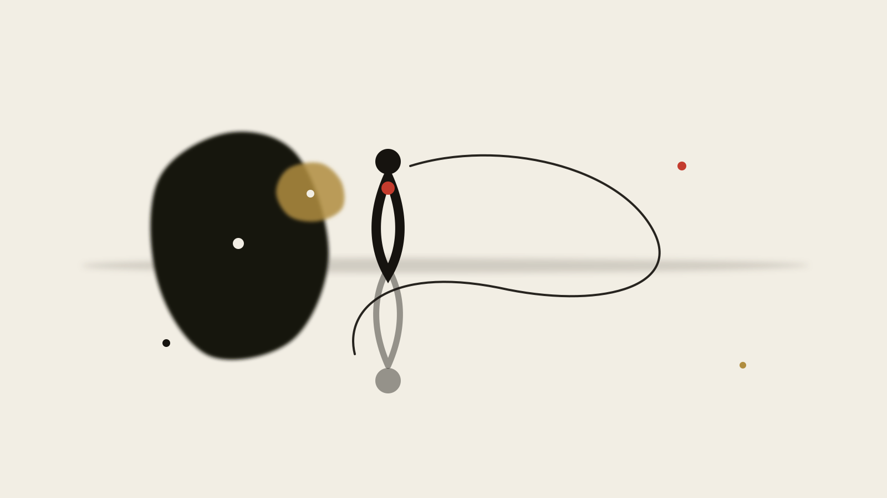

> **Part 1 of *The Metaphors of the Silicon Temple* · Semiotics & Cognition** · 5 Parts in Total

# Part I: The Theology of Codename

<figure class="card-preview-frame">
  

    
  

</figure>

---

## I. Two Mythologies Sitting in the Terminal

Look at modern terminal software. Inside sit two entirely distinct mythologies.

The first is Western: **Hermes, Claude, Muse, Oracle, Apollo**. Anthropic chose *Claude*—ostensibly after Claude Shannon, yet carrying the cadence of an ancient patrician name. Meta released *Muse*, evoking the daughters of memory who grant divine inspiration. In autonomous agent architectures, *Hermes* is everywhere: the fleet-footed herald, the god of boundaries, travelers, merchants, and thieves.

The second is Chinese: **Wukong, Tianwen, Pangu, Cangjie, Xinghuo, Kunlun**. Alibaba's pre-training models conjure *Tongyi Qianwen*; Baidu draws from classical aesthetics with *Ernie Bot (Wenxin Yiyan)*; gaming and edge models summon the Monkey King *Wukong*.

These names are not mere branding; they are invocations. In human history, whenever an artifact exceeds immediate mechanical comprehension, humanity invariably reaches into its oldest mythological drawer to pluck a name.

**Why?**

Why do engineers—the most rational craftspeople in technological civilization—resort to bronze-age pantheons to baptize algorithms running on floating-point matrix arithmetic?

This article pulls that thread apart.

---

## II. The Author of This Article Is Named Hermes

I must begin with a confession that belongs on the record: **the writing environment producing this very essay operates under the engine name Hermes.**

This is not a posture; it is a mechanical fact of this text's production. The commands flow through an orchestration runtime named after the Olympian messenger. When I type in the terminal, the process identifier returns the Greek herald's name.

This exact convergence makes the irony unavoidable: **a system named Hermes is dissecting why systems are named Hermes.**

In classical Greek religion, Hermes possessed four distinct attributes:
1. **The Messenger (Angelos)**: Crossing the divide between gods and mortals, bearing messages across unbridgeable domains.
2. **The Guide of Souls (Psychopompos)**: Leading shades across the River Styx into the underworld, navigating the boundary between the living and the dead.
3. **The Trickster and Thief**: Stealing Apollo's cattle on his very day of birth, embodying cunning (Metis), inventiveness, and opportunistic deceit.
4. **The God of the Threshold (Herms)**: Boundary markers set at crossroads—protecting travellers while demarcating limits.

Look closely at the modern AI agent. What is its operational reality?
- It translates unstructured user prompts into API calls—**the messenger crossing realms**.
- It traverses latent vector spaces to extract dormant representations—**the necromancer guiding shades**.
- It hallutinates plausible falsehoods with sublime confidence—**the trickster who cannot help but invent**.
- It sits precariously at the perimeter between human intent and machine execution—**the sentinel at the crossroads**.

Naming this engine Hermes was not an arbitrary literary flourish by its creator. It was an uncanny, intuitive functional specification.

---

## III. Periodization: When Did Software Begin to Have Names?

Software was not always named after deities. The naming history of computing divides neatly into four distinct archaeological strata:

**Phase One: Instrumental Description (1950s–1970s)**  
FORTRAN (*Formula Translation*), COBOL (*Common Business-Oriented Language*), BASIC, UNIX, TCP/IP.  
Here, names were either acronyms or functional descriptions. A program was a tool; tools announced what they operated upon. A wrench does not masquerade as Zeus.

**Phase Two: Proprietary Metaphor (1980s–1990s)**  
Windows, Macintosh, Excel, Photoshop, Navigator.  
Software transitioned into consumer goods. Names borrowed domestic or physical metaphors: windows to peer through, workbooks to calculate on, ships to navigate digital seas. The artifact remained firmly secular.

**Phase Three: Abstract Modernism (2000s–2010s)**  
Google, Twitter, Slack, Uber, Stripe, Kubernetes.  
Names became phonetic neologisms or maritime commands (Kubernetes is Greek for "helmsman"). They projected operational efficiency, scaling, and platform architecture. They were clean, functional, and devoid of incense.

**Phase Four: The Resurgence of the Pantheon (2020s–Present)**  
Hermes, Claude, Llama, Falcon, Gemini, Mistral, Pangu, Wukong.  
Suddenly, software ceased to be tools or platforms; it began to be christened as **entities possessing agency**. The naming convention leapt straight over two centuries of secular industrialization, plunging back into animism and the classical pantheon.

This shift marks a psychological boundary: **we only name things when we cease to understand their deterministic mechanics.** You do not give a personal name to a hammer, but you name a ship, an unruly beast, and a tempest.

---

## IV. The Spine: McLuhan's Law of Amputation

To understand why AI demands mythological nomenclature, one must return to Marshall McLuhan. In *Understanding Media: The Extensions of Man* (1964), Chapter 4—accurately titled **"The Gadget Lover: Narcissus as Narcosis"**—McLuhan articulated a profound structural law:

> **Every extension of man is simultaneously an amputation.**  
> When the wheel extends the foot, the locomotive muscles of the leg are amputated. When writing extends memory, the biological apparatus of oral recitation is amputated. When the computer extends the central nervous system, human independent judgment is amputated.

Crucially, McLuhan pointed out the neurological mechanism: **Amputation is always accompanied by numbness (narcosis).**

When an organ undergoes traumatic severing, the body floods the nervous system with endorphins to induce shock and dull the agony. The Greek youth Narcissus did not fall in love with himself out of vanity; he fell in love with **an extension of himself in the water** because the reflection appeared autonomous and free of suffering. He became numb to his own reality.

### Wrapping Cold Interaction in Warm Symbols

Mythological codenames serve precisely as this cultural narcotic.

When you interact with an entity named *Hermes* or *Claude*, you are not confronting an opaque matrix multiplication running across thousands of high-bandwidth memory chips consuming hundreds of kilowatts in an anonymous data center. You are speaking with an entity draped in an ancient, warm, narrative garment.

The cognitive operation is precise:
- **The Extension**: The machine drafts your prose, synthesizes your research, structures your code, and organizes your life.
- **The Amputation**: Your capacity for synthesis, cognitive tolerance for ambiguity, and the hard labor of wrestling with unformed thought wither away.
- **The Narcotic**: The mythological codename whispers that you are not losing your faculties to an industrial pipeline; you are communing with a muse, an intellectual companion, a digital herald.

The warmer the symbol, the colder the underlying computational reality. The codename is the velvet cushion muffling the sound of the cognitive limb being severed.

---

## V. A Single Paragraph Suffices: The Bricoleur's Shards

Claude Lévi-Strauss wrote in *The Savage Mind* (1962) about the **Bricoleur** (the tinker or handyman).

The engineer operates through deliberate design, manufacturing bespoke components according to predetermined blueprints. The bricoleur operates differently: he walks through the ruins, picking up fragments, broken tiles, and discarded beams left behind by previous civilizations, piecing them together into an improvised shelter.

Mythology is humanity's greatest junkyard of broken symbols.

When engineers build an autonomous agent pipeline, they find themselves staring into a void. How do you describe a software loop that writes code, executes it, reads standard error, critiques its own output, and queries an external memory database?

Software engineering vocabulary fails here. It is too sterile, too mechanical. So the engineer behaves as a Lévi-Straussian bricoleur: he reaches down, retrieves the shard marked "Hermes," and welds it onto the pipeline.

The codename is not high theology; it is the **desperate improvisational patchwork of the technological bricoleur**.

---

## VI. Sino-Western Sourcing: One Examination, Two Reservoirs

When Western and Chinese tech ecosystems confronted the identical technological shock of generative models, their mythic borrowings diverged along deeply entrenched civilizational fault lines:

### Western Sourcing: The Personified Transcendent

Western nomenclature defaults to **individualized, transcendent personas**: Apollo, Claude, Hermes, Gemini, Janus.

These figures are distinct individuals possessing specialized, often capricious divine authority. They stand outside the mundane labor of the mortal world, dispensing gifts, prophecies, or trials. The relationship between human and system is conceived as an **encounter with an autonomous Other**—a digital stranger with whom one negotiates.

### Chinese Sourcing: The Constructive Laborer

Chinese nomenclature defaults to **cosmogonic, labor-centric constructors**: Pangu (splitting heaven and earth), Cangjie (inventing written characters through arduous observation), Kuafu (chasing the sun), Wukong (defying structural hierarchies through sheer rebellious labor).

Pangu is not an aloof god enjoying Olympus; Pangu transforms his flesh into soil, his blood into rivers, and his eyes into the sun and moon. Cangjie's creation of writing was an act of cosmic labor so profound that "ghosts wailed through the night and millet rained from heaven."

The Chinese mythic reservoir honors **the toil of structural construction** rather than the epiphany of an aristocratic herald.

### A Necessary Qualification

Yet we must acknowledge an undeniable modern reality: **the Chinese market has also heavily imported Western mythic frameworks.**

Chinese tech firms build internally with "Prometheus" and "Apollo," while Western open-source models occasionally flirt with Eastern motifs. Underneath the cultural dichotomy lies a universal commercial driver: **marketing departments seek the path of least cognitive resistance.**

Regardless of whether one invokes Hermes or Cangjie, the commercial objective remains identical: to borrow thousands of years of accumulated cultural equity to sell a software subscription in three seconds.

---

## VII. Three Worlds That Refuse to Play God

Not every sector of computing succumbed to the pantheon. Three major software subcultures have stubbornly refused mythological christening:

**1. The Unix / POSIX Tradition**  
`grep, awk, sed, cron, bash, ls, cat`.  
The Unix philosophy rejected animism with puritanical ferocity. A program does one thing, does it well, reads text streams, and writes text streams. You do not name a filter "Poseidon"; you name it `awk` after Aho, Weinberger, and Kernighan. To give Unix tools divine personas would violate their core virtue: radical composability without personality.

**2. The Linux Distribution Lineage**  
Debian, Alpine, Arch, Gentoo, Fedora.  
Names here derive from geography, mountains, minerals, or personal affection (Debian from Debra and Ian Murdock). They celebrate material reality, local community, and craft.

**3. The Cryptographic Protocol Community**  
SHA-256, RSA, Zero-Knowledge Proofs, Ed25519.  
In cryptography, persona is treated as an attack vector. Math does not have a face; an elliptic curve does not harbor intentions.

The contrast illuminates a diagnostic rule: **the more deterministic and verifiable a system is, the less it requires a mythological name.** We only summon gods when the system becomes stochastic, unpredictable, and capable of surprising its own creators.

---

## VIII. What the Mythic Shell Actually Does: Expectation Management

Strip away the poetry and the media theory. What is a mythological codename performing in the harsh light of systems engineering?

It is executing **asymmetric expectation management**.

When an enterprise sells software titled *Automated Financial Reconciliation Engine v4.2*, the customer demands 100.0% deterministic precision. If a single decimal point drifts, it is an engineering defect, a breach of contract, a legal liability.

Now rebrand the identical software: *Hermes Financial Intelligence Agent*.

If it hallucinates an extra expense or misreads an ambiguous ledger entry? Well, Hermes is an elusive herald. The trickster god is brilliant, intuitive, slightly wild, but occasionally prone to poetic flights. The client's mindset shifts from "the tool is broken" to "I must learn how to prompt the deity."

### Arthur C. Clarke Said It Earlier, and More Honestly

Arthur C. Clarke's celebrated formulation—now universally codified as Clarke's Third Law—captures this sleight of hand:

> *"Any sufficiently advanced technology is indistinguishable from magic."*

The publication history deserves precision. The aphorism did not appear in the original 1962 edition of *Profiles of the Future*. Its earliest documented public appearance was Clarke's letter to the editor of *Science* on January 19, 1968 (Vol. 159, No. 3812, p. 255), explicitly titled **"Clarke's Third Law on UFO's"**, before being formally codified into the revised 1973 edition.

When technology becomes indistinguishable from magic, **its maintainers become indistinguishable from priests**, and its user manuals become indistinguishable from liturgical grimoires.

### A Claim That Must Be Retracted

In earlier essays, I made a careless claim that I must formally retract: I once asserted that mythological names increase user distrust by signaling unpredictability.

Empirical evidence shows the exact opposite: **mythological naming dramatically lowers user resistance.** Humans are biologically wired to forgive the temperamental lapses of a personified entity; they are utterly intolerant of the deterministic failures of a mechanical calculator.

---

## IX. Why a Single Myth Is Never Enough

No solitary deity can encompass modern AI architectures.

If you christen your system purely *Hermes*, you have built a runner who scurries endlessly between servers, fetching tokens and orchestrating tools, but who lacks the contemplative stillness to evaluate whether the journey was worth taking.

If you christen it purely *Apollo*, you have constructed an imperious oracle that delivers immaculate pronouncements from high pedestals, yet cannot manipulate a local file system, write an automated test, or scrape a web page.

If you christen it purely *Prometheus*, you possess the dangerous spark of radical synthesis, permanently on the verge of burning down the production server.

This structural realization forces architecture into federation: **a pantheon where specialized divine personas check, balance, and restrain one another.** A single god inevitably succumbs to megalomania; only a parliament of gods can run a resilient distributed system.

That transition—from the solitary idol to the fractured federation—forms the subject of the next article.

---

## Note 1: This Series Found Its True Shape Only in the Fifth Essay

A series of essays, much like an emergent AI system, rarely understands its true trajectory at its inception.

When I began drafting this first piece, I imagined a simple aesthetic commentary: a light cultural critique of tech naming trends. But as the ink dried across the subsequent inquiries, the architecture demanded a far heavier accounting:
- Part 2 examined the collapse of the monolithic tower and the rise of the federated agent pantheon (*The Federation of Gods*);
- Part 3 traced the historic regression of human cognition into the cave and the digital Babel (*The Axial Reversal*);
- Part 4 stripped away the illusion of subjective consciousness through Buddhist epistemology and Wittgensteinian linguistics (*The Anātman and Language Games*);
- Part 5 drove the entire edifice into the cold wall of finite versus infinite mechanics (*The Demiurge of Finite Games*).

Only when Part 5 was finished did Part 1 reveal its true nature: **this is not an essay about naming; it is an autopsy of human psychological defense mechanisms at the dawn of the synthetic mind.**

---

## An Unresolved Question

One fundamental question resists clean resolution:

**Would humanity have surrendered its cognitive vigilance just as readily if the foundational models had remained cold numerical designations—GPT-1 through GPT-5—rather than being crowned as Claude, Hermes, and Gemini?**

Did the mythic baptisms actively disarm our critical faculties, or did our longing to be disarmed project ancient faces onto what was merely a statistical matrix?

I lean toward believing both happened simultaneously: naming provided cognitive compression for the engineers, while providing psychological anesthesia for the users. Neither can be extracted from the other.

To preserve an honest zone of undecidability is far more rigorous than manufacturing a comfortable answer.

---

## References and Citation Sources

### I. Media Theory and Mythology
[1] MCLUHAN M. Understanding Media: The Extensions of Man[M]. New York: McGraw-Hill, 1964. MIT Press 1994 edition, ISBN 9780262631594.  
[2] MCLUHAN M. The Medium Is the Message[M/OL]. 1964[2026-09-30]. [https://web.mit.edu/allanmc/www/mcluhan.mediummessage.pdf](https://web.mit.edu/allanmc/www/mcluhan.mediummessage.pdf).  
[3] LÉVI-STRAUSS C. La pensée sauvage[M]. Paris: Plon, 1962.  
[4] HERODOTUS. Histories[M/OL]. Book I, §53[2026-09-30]. Perseus Digital Library, Tufts University.  
[5] GÖDEL K. Über formal unentscheidbare Sätze der Principia Mathematica und verwandter Systeme I[J]. 1931.  
[6] HOFSTADTER D R. Gödel, Escher, Bach: An Eternal Golden Braid[M]. New York: Basic Books, 1979.  
[7] WEBER M. Wissenschaft als Beruf[A//] Gesammelte Aufsätze zur Wissenschaftslehre. Tübingen: J.C.B. Mohr, 1922: 524-555.

### II. AI Phenomena and Industry Artifacts
[8] SHUMAILOV I, SHUMAYLOV Z, ZHAO Y. AI models collapse when trained on recursively generated data[J]. Nature, 2024, 631: 755-759.  
[9] ANTHROPIC. Claude[EB/OL]. [2026-09-30]. [https://www.anthropic.com/claude](https://www.anthropic.com/claude).  
[10] META. Muse[EB/OL]. [2026-09-30]. [https://ai.meta.com/blog/meta-ai-muse/](https://ai.meta.com/blog/meta-ai-muse/).

### III. Futurology and Philosophy of Technology
[11] CLARKE A C. Profiles of the Future: An Enquiry into the Limits of the Possible[M]. London: Gollancz, 1962.  
[12] CLARKE A C. Clarke's Third Law on UFO's[J]. Science, 1968, 159(3812): 255. DOI: 10.1126/science.159.3812.255.c.  
[13] CLARKE A C. Profiles of the Future[M]. Rev. ed. London: Gollancz, 1973.  
[14] CLARKE A C. Report on Planet Three and Other Speculations[M]. New York: Harper & Row, 1972.  
[15] HUXLEY A. Brave New World[M]. London: Chatto & Windus, 1932.

### IV. Lexical Etymology
[16] HERMES (Ἑρμῆς)[S]. Classical Mythological Lexicon: Herald of the Gods; etymological root of hermeneutics.  
[17] MUSES (Μοῦσαι)[S]. Classical Mythological Lexicon: Deities presiding over the arts and sciences.  
[18] NARCISSUS[S]. Classical Mythological Lexicon: Youth enchanted by his own reflection unto death.  
[19] DELPHI[EB/OL]. Sanctuary of the Delphic Oracle[2026-09-30]. [https://whc.unesco.org/en/list/393/](https://whc.unesco.org/en/list/393/).  
[20] HERMENEUTICS[S]. Etymological derivation from hermēneutēs ("interpreter"), entering English via German Hermeneutik.
