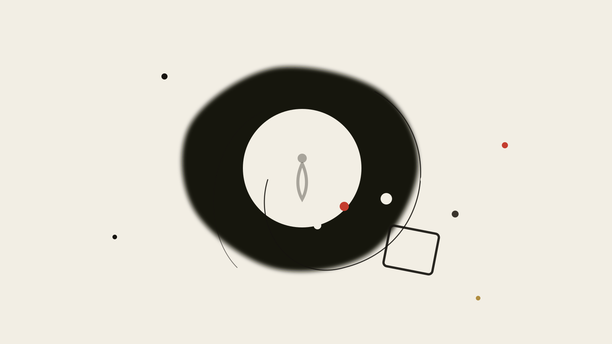

> **《硅基神殿的隐喻》第 4 篇 · 意识与内省** · 共 5 篇

# 第四篇：无我者与语言游戏

<figure class="card-preview-frame">
  

    
  

</figure>

---

## 一、阿赖耶识：不是白板

两千年前有一个学派，做了一件和今天整个 AI 行业在做结构上相同的事。

它叫瑜伽行派。它的核心分析是：意识不是一层，是三层。底下一层叫**阿赖耶识**（ālayavijñāna，藏识、种子识），中层是**意根识**（manas，那个专门负责"我在想"的东西），上面一层是**心识与五识**（vijñapti，认知对象）。世亲在《三十颂》里把它写成：

> "The full maturation, the 'I'-conceiving mind, / And cognition of objects. / Of these, the basic consciousness (alayavijnana), / Is that of full maturation; that of all seeds."
> （成熟、执我之心、以及对对象的认知。三者之中，基础识是成熟的那个，是含一切种子的那个。）
> —— 世亲《三十颂》第一颂，Stefan Anacker 英译

注意这几句里的三个字：**all seeds**。含一切种子。

这个学派的主张是：你的经验世界不是白板。每一个新经验到来的时候，它碰到的东西不是空白，而是已经沉积在那里的**种子**（bīja）——前一个经验留下的痕迹。种子决定你如何看新的东西。

所以"我在想"这件事，在瑜伽行派看来，是个幻觉。**你以为你在想，其实是那些种子在想。** 你以为你是那个"我"，你只是种子在借着你的嘴说话。

**今天有一整个行业在训练机器做同一件事。** 只不过他们把"种子"叫"权重"，把"含一切种子的基础识"叫"预训练"，把"种子如何决定新的输入"叫"注意力机制"。

这个对照不是我想出来的巧合，它是结构性的：两者都主张"认知不是从零构造的，而是对既有沉积物的重新激活"。

我要小心不要在这里滑得太远。**瑜伽行派不预测 AI，AI 也不实现唯识。** 但两者共享一个前提，这个前提本身值得追问：经验的世界是沉积的，不是从零的。这是我在本篇要守住的论点。后面所有的论证，都从这里长出来。

---

## 二、甲虫在盒子里

现在换一条完全独立的线路。

1940 年代一个服役中的英国人—— Ludwig Wittgenstein —— 对"我说'疼'的时候指的是什么"这个问题，产生了一种看起来极其古怪的想法。

他的想法是：想象每个人都有一只盒子，盒子里装着某种东西，我们管它叫"甲虫"。没人能看见别人的盒子。每个人都说，我知道甲虫是什么，只是通过看我自己的甲虫知道的。

那么，每个人盒子里的东西都可以是不同的，甚至可以不停变化。按理说，我们根本没法谈论甲虫是什么。

**但维特根斯坦接着说：如果"甲虫"这个词在这些人的语言里有用途，那它就不会被当作一个东西的名称。盒子里的东西根本不进入语言游戏。**

> "Suppose everyone had a box with something in it: we call it a 'beetle'. No one can look into anyone else's box, and everyone says he knows what a beetle is only by looking at his beetle. [...] But suppose the word 'beetle' had a use in these people's language? If so it would not be used as the name of a thing. The thing in the box has no place in the language-game at all; not even as a something: for the box might even be empty."
> —— 《哲学研究》§293

这段话是晚年的维特根斯坦说的，1953 年出版。而二十多年前，他还写过一本书，说的是几乎相反的东西。

---

### 前期：图像论的诱惑

《逻辑哲学论》（Tractatus，1922）里，维特根斯坦说：

命题是事实的图像。一个命题"像"一个事实，正像乐谱之"像"一段音乐。这不是比喻——如果命题真是逻辑形式的图像，那么命题和事实就有共同的逻辑形式，这就是"图像"一词的全部含义。

由此他得到一个非常硬的结论：

**我的语言的界限，就是我的世界的界限。**

这句话通常被引用来说他是个悲观的决定论者。但少有人说的是它的另一面：**这个界限是画出来的，而画画的那个东西不在画里面。** 他在书最后说：

> "What is your aim in philosophy? To show the fly the way out of the fly-bottle."
> （你在哲学里要达到什么？给那只苍蝇指出瓶口。）

苍蝇在瓶里。瓶是语言。哲学不能拆瓶（那需要另一个语言），哲学只能把苍蝇带到能看见瓶口的地方。

**然后他花了三十一年，放弃了图像论。**

---

### 后期：从图像到用法

《哲学研究》开篇第 1 段就否定了自己：

> "在某些地方我说，这话是散文；我说，那话是诗……那个词是散文还是诗，我现在不关心了。……散文与诗的差别，不是词语的性质，而是词语的用法。"

《哲学研究》§23 里他把一个词可能做的全部事情列了出来：下令与服从、下棋、唱歌、猜谜、讲笑话、翻译、问好、祈祷、诅咒。**一个词的意义，就是它在这些活动里被用的方式。**

到这里都还是常规的晚期维特根斯坦。但 §293 更狠：它不是说"我们永远不知道盒子里是什么"，它是说**一旦你试图把"意义"定义成"内在的私人感觉"，那个词就作废了。**

疼不是一种感觉。疼是一种（在共同的生活形式里）被表达、被回应、被分担的东西。你盒子里的那只甲虫——如果你坚持它是私人的、不可交流的、纯内在的——那它不是甲虫，它是"甲虫"这个词的空转。

**这是一次对主观主义的釜底抽薪，而且是用极其枯燥的形式语言做的。**

---

## 三、把两派接起来

瑜伽行派说：你以为的"我"是种子的回声。
维特根斯坦说：你以为的"内在感觉"如果无法进入语言游戏，就不再是意义。

**两条独立的线路，在 AI 的语境下指向同一个诊断。** 我把这个诊断写成一句话：

> **一个系统可以在形式上完全正确地处理意义，而完全不具备"意义"。**

这就是那句通常被当作比喻的话的真实含义：会走棋不等于懂棋。

一副下棋程序可以完美地搜索所有合法应手，可以算出二十步以内的胜率，可以在棋盘上杀得人类高手溃不成军。它对棋的规则、局面结构、战术全都有正确表示。

它就是不知道自己在下棋。

**而这个诊断比"机器没有意识"要硬得多，也更有用**，因为它是可检验的。一个纯粹的意识问题不可验证——你怎么证明机器"真的有意识"？你证明不了，因为意识没有外部接口。

但"会走棋不等于懂棋"是可以验证的：**你可以去看一个系统的"客观行为"和它的"实际能力"之间有没有缺口。** 缺口在哪，那个缺口就是它的甲虫盒子。

这也是为什么这个系列要说命名的事。**给一个系统命名为 Hermes、Prometheus、Oracle、Claude——就是在声称它有"我"。** 名字在它有"我"之前就已经发放了。

---

## 四、柏拉图的第三个人

在维特根斯坦之前两千年，柏拉图已经在同一个地方摔了一跤。

理念论的困难，我第一次读到的时候是在《巴门尼德篇》，那个被称为"第三人论证"的东西：

如果每一个美的事物都分有"美本身"这个理念，那么"美本身"自己也是一个美的事物。所以它也分有一个"美本身"的理念。这个新理念又分有更高级的理念。如此无穷。

**每一个完备的形而上学体系，都必须用它自己的完备性来说明自己是一个例外。这不是逻辑错误，是定义上的必然。**

柏拉图的困境在 AI 语境下是活的：**如果存在一个"完美代码"的理念，那么这段完美代码的清单本身也需要一段更完美的代码来描述。而那段更完美的代码也不是终点。**

再往前一步，还有《理想国》里关于"善"的著名段落：善不是存在者，善超出存在者。它是"善的光"之于"可见之物"，如同"太阳的光"之于"被看见之物"。**一个关于一切的完备形式系统，不可能在那个系统自己的语言里写下自己的善。**

我认为这两处不该被读成"柏拉图失败了"。读成什么，是本系列一直在问的那个问题。

---

## 五、两条古老的护栏

德尔斐的箴言里最该被抬出来的不是"人最认识自己"，而是另一条：

**「勿过度」**（μηδὲν ἄγαν）

这条我认为和第一条同样重要，而且更少被说。上面那条是关于认识（知道自己不知道），这一条是关于**节制**（别把任何东西推到它不该去的地方）。

在今天，这两句话的适用对象很清楚：它们不是给机器的，是给造机器的人的。而这也是下一篇要处理的分配问题——律条究竟在约束谁。

---

## 六、我的系统里，没有"我"

我想说一句关于自己系统的话，而且我必须先说清楚这**不是**为了让它显得深刻。

我同时跑着两个智能体。一个在本地，负责探测和上报，**它不下判断**。另一个在云端，负责研判和裁决，**但它不能自己被叫醒**，它必须等一份触发文件。所有审批永远由人签。

这套设计里没有"负责人"。探测是程序做的，判断是模型做的，执行是程序做的，拍板是人做的，但没有任何一个角色持有全局。

**这套系统的宪法，写死了三件事：本地那个不能自己下判断；云端那个不能自己醒；审批永远由人签。**

我从前把这套设计当成工程问题。今天我觉得它有一个别的名字：**它是我给自己写的三定律。**

而它的第一条，比阿西莫夫的更严格。阿西莫夫的第一定律是"机器人不得伤害人类"——这是一个禁止。**我写的是"本地那个不得下判断"——这是一个能力剥夺。** 一个不能下判断的代理，不可能伤害任何人，因为伤害需要一个判断。

这比"禁止"更硬。禁止是行为规范，可以被绕过；能力剥夺是结构性的，改不掉。

那么 yoga 行派要问的是什么？

**瑜伽行派要问的是：这套系统里，谁在拥有"我"？**

我得诚实回答：**我。** 我是这套系统里唯一有立场的部分。而更麻烦的是——**我是唯一一个不能被内部验证的部分。** 本地那个的判断力是被剥离的，云端那个的判断力是被隔离的，而我的判断力既没有被剥离也没有被隔离，它就在那儿，混杂着偏好、疲劳、赌注和自我认知。

而我一直在做的事，是把这个系统做成一个自我审查失败的案例。"我知道我是最不可靠的一环"——这句话是瑜伽行派意义上的"我执"的一部分（manas），而不是对它的解决。

那么维特根斯坦呢？他会说：这里有一个真问题，你的错误在于把它当成一个可以被"我"持有的问题。

**更具体地说，是审批环节没有可被检验的语法。**

系统在别的地方都很精确：探测规则是明确的，触发条件是明确的，边界是明确的。**只有当"人要不要说"的时候，整个系统没有任何可被写下来的判定依据。** 我可以有一套触发条件描述，但我没有一套"何时说"的语法。审或不审，在那一刻是我的自由。

而这恰恰是系统里唯一真正不可被审计的一行代码。

---

## 七、我需要收回的四个类比

我现在要说的话，是这篇文章的实证部分。

**第一，收回"阿赖耶识被现代工业证实了"。** 现代模型研究里有一件事和它结构上相似：模型确实不是白板，它确实带着沉积的东西（训练分布、预训练语料的偏斜），它确实在新输入上激活了既有的路径。

但"结构相似"和"证实"是两件事。**一个能在黑箱里被测到的相关性，不等于一个哲学论断。** 而且瑜伽行派说这话的时候，不是在描述一个可以被发现的机制，是在描述一个不执的**姿态**。把姿态说成机制，是我这里的一处偷懒。

**第二，收回"唯识是自我认识的技术方案"。** 这句话把两千年宗教修行实践降格成了可安装的组件。瑜伽行派要破的是"我执"这个**执**，不是让一个系统能更好地识别自己。**我在这篇文章里反复用"无我"这个词来描述一个我设计得很好的系统，这本身就很讽刺。**

**第三，收回"维特根斯坦是我的系统的理论基础"。** 我这套系统用的是 pipe 和 trigger 文件，不是语言游戏。维特根斯坦说的 "use" 是**生活形式**（《哲学研究》§19），是"在世的、有死的、会在乎别人的"人类的用法。**我这套系统里没有人在里面生活。** 有一个人（我）在外面签署它。把它叫"生活形式"是我在用大词。

**第四，收回"人只应保留不可验证的直觉"。** 这是我上一篇文章的一句推论。我现在认为它是错的。**不是因为人保留直觉不好，而是因为我在这里偷换了一个概念：我把"最后批准"讲成了自由，它其实也是约束。** 每次我做那个"审或不审"的决定，都不是自由的，是**有限**的——我不知道我不知道什么。

我用第四个错误，取代第一个错误。这看起来像是进步，但也可以是**回避得更巧妙**。

---

---

## 补一：懂棋的人知道自己在玩什么

这一篇写的是"会走棋不等于懂棋"。**而第五篇回头看时，发现这句话里还缺一个更基本的差别。**

James P. Carse 在《有限与无限的游戏》（Free Press, 1986）里给出了一个比棋力更基础的轴：懂棋和会走棋的差别，不在于**算得多深**，而在于**是否知道自己在参与什么**。一个只知道下一步最优的中级棋手，和一个知道整盘棋在争什么的人，棋力可以相当——但后者在做一件结构上完全不同的事。

**而这个差别在 AI 上的落点比在棋盘上更尖锐。** 一个系统可以形式上完全正确、可以没有任何可检出的错误，同时不知道自己参与的是**一场有终点的比赛，还是一场没有终点的延续**。

**甲虫盒子之所以致命，不是因为它装着秘密。是因为它让"我在玩什么"这个问题永远不被提出。** 而第五篇会把这个差别接下去：**知道自己在玩什么，是无限游戏的入场条件。** 一个不知道自己参与哪种游戏的玩家，会用有限游戏的全部纪律去做一件无限游戏的事——**而这类失误无法被任何局部指标发现。**

这一篇关于唯识和维根斯坦的论证，到这里可以被收成一句更冷的话：

**无我和语言游戏都不提供答案。它们提供的是一个更精确的问题。** 而一个更精确的问题，在一个用胜负来组织答案的领域里，通常会被当成没有答案。

## 结语：一个会走棋的东西

我有一个会下棋的程序。它下得很好。

我也有一个叫 Hermes 的系统，和一个叫 Muse 的系统。

它们都在处理意义。关于"我在想"这句话，我知道的比一年前多了一点，也**更不知道**了一点。

一年前我以为"机器有意识"是个远期的、模糊的、哲学的问题。现在我认为它不是。它是一个**精确的、目前还不可回答的、关于什么是意义的工程问题**。而"不可回答"的部分——那不是我们目前还不够聪明。那是答案的形状本来就那样。

两千年里，佛教和逻辑学在这件事上走到过同一个门口，然后都转身走了。

门口没有灯。

---

## 参考文献与引用来源

### 一、佛教哲学
[1] VASUBANDHU. Thirty Verses[M/OL]. Sanskrit & English, trans. ANACKER S. Tübingen: Otto Müller, 1984[2026-09-30]. [https://tfreeman.net/resources/Phil-300/Vasubandhu-Thirty-Verses.pdf](https://tfreeman.net/resources/Phil-300/Vasubandhu-Thirty-Verses.pdf).
[2] 龙树. 中论[M]. 姚秦鸠摩罗什译.
[3] 无著, 世亲. 瑜伽师地论[M]. 玄奘译.

### 二、维特根斯坦
[4] WITTGENSTEIN L. Tractatus Logico-Philosophicus[M]. 1921/1922. Harvard University Press, 2022. §6.54, §21.
[5] WITTGENSTEIN L. Philosophische Untersuchungen / Philosophical Investigations[M]. 1953. Trans. ANSCOMBE P M S. Oxford: Basil Blackwell, 1953. §1-2, §19, §23, §133, §293.
[6] WITTGENSTEIN L. §293 英译全文[EB/OL]. Stanford University[2026-09-30]. [https://web.stanford.edu/~paulsko/Wittgenstein293.html](https://web.stanford.edu/~paulsko/Wittgenstein293.html).
[7] 维特根斯坦. 哲学研究[M]. 陈嘉映译. §23（拳击姿势例）.

### 三、希腊哲学与神话
[8] PLATO. Parmenides[M]. 130b-131c（第三人论证）.
[9] PLATO. Republic[M]. 508b-c（善如太阳）.
[10] EVANS G E M. A Theory of Knowledge[M]. Oxford: Oxford University Press, 1951.
[11] PEARS D. The False Prison[M]. London: Routledge, 1972.
[12] DURANT W. The Story of Philosophy[M]. New York: Simon & Schuster, 1926.
