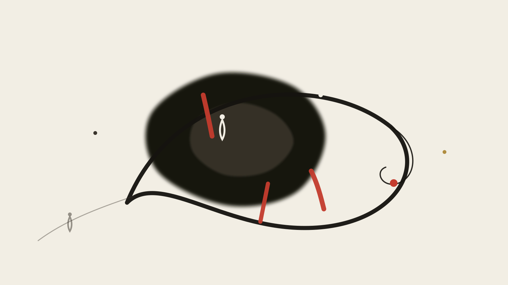

> **《硅基神殿的隐喻》第 5 篇 · 制度与政治** · 共 5 篇

# 第五篇：有限游戏的造物主

<figure class="card-preview-frame">
  

    
  

</figure>

> **主线理论**：James P. Carse《有限与无限的游戏》(1986)

---

## 一、一个无法收尾的行业

先说一个结构上的怪事。

2015 年之前，行业里衡量一个模型的尺子很朴素：它答对多少题。
今天，尺子变成了：某个基准上的分数。然后那个分数被刷满，于是出现新的基准。然后新的基准也被刷满。

**这个循环没有终点。** 它不是某个公司没做好，导致大家换了个赛道；而是这个循环在结构上无法结束——因为每产生一个"最好的成绩"，就同时产生一个"标准已达成"的事实，而"标准已达成"是有限的定义。

于是我们得到一个奇怪的组合：

**技术本身是无限游戏的形状。** 模型没有一个"完成"状态。你无法在训练开始时写出"它会做什么"的完整规格，然后照着验收。能力是在训练过程中长出来的，不是被安装上去的——这就是"涌现"这个词原本的意思。你也赢不了它。基准分数被追平不等于任何东西被完成，因为一个追平了的基准立刻变成一个过期的尺子。

**但我们组织这门技术的方式，是有限游戏的形状。** 排行榜、市场份额、参数量、发布会日期、估值——**每一个都是有限游戏的计数器，因为它们都有"第一名"这个位置，而一个只有第一名、没有终点的排行榜，本身是矛盾的。**

我把这个错位称为**用无限游戏的技术，打有限游戏的仗**。

这不是道德指控。它是一个结构描述。而结构描述的好处是：它可以被追问"错在哪"，道德指控不行。

---

## 二、Carse 的区分

1986 年，一位在纽约大学教宗教的教授出了一本 150 页的小书。**James P. Carse，《有限与无限的游戏：作为游戏与可能性的生命愿景》**（*Finite and Infinite Games: A Vision of Life as Play and Possibility*，New York: The Free Press, 1986）。

这本书第一章第一句是：

> "There are at least two kinds of games. One could be called finite, the other infinite. A finite game is played for the purpose of winning, an infinite game for the purpose of continuing the play."
> （至少有两种游戏。一种可以叫做有限的，另一种可以叫做无限的。**有限游戏是为赢而玩，无限游戏是为继续玩而玩。**）

**这一句就够用了。** 但我想强调的是它经常被读错的地方。

Carse 的书被引用时通常被当成一本励志读物："要玩无限游戏，要眼光长远，不要执着于输赢。"**这个读法把一本书里最锋利的东西磨平了。** 因为 Carse 的区分不是道德训诫，是两个**结构上不同的数学对象**——他自己在扉页说明写这本书**不需要高等数学背景**（*Without advanced mathematical skills*），但它讲的确实是形式。

那么两者的结构差别到底在哪？出版社的官方摘要给了最干净的一份（WorldCat 收录，出版方提供）：

> "Finite games are played in order to be won, which is when they end. [...] Infinite games [...] Their object is not winning, but ensuring the continuation of play. **The rules may change, the boundaries may change, even the participants may change—as long as the game is never allowed to come to an end.**"
> （有限游戏为赢而玩，赢的时候游戏就结束。无限游戏的对象不是赢，而是确保游戏继续。**规则可以变，边界可以变，参与者甚至可以变——只要游戏不被允许结束。**）

**请注意这句话的力学方向。** 有限游戏的规则是**用来保证游戏会结束的**；无限游戏的规则是**用来保证游戏不结束的**。这是完全相反的两种规则功能，不是同一套规则的两种态度。

还有两句更要紧的，我核过原书页码：有限游戏的玩家**在边界之内**玩，无限游戏的玩家**与边界一起玩**（"Finite players play within boundaries; infinite players play with boundaries."，1986 年初版 **p.10**，第十一节末）；以及——

> "if surprise is no longer possible, all play ceases."
> （如果不再可能有意外，所有的游戏都停止。1986 年初版 **p.18**，第十七至十八节。）

前一句的意思是：**有限游戏把边界当裁判给的界线，无限游戏把边界当自己手里的材料。** 规则不再是被遵守的东西，而是被重新设计的对象。这两句是理解整篇的关键，所以我在原书里逐字核过，页码是 1986 年初版的印次页码。

**最后一层。** 这本书的结尾是：

> "There is but one infinite game."
> （只有一个无限游戏。1986 年初版 **p.149**，第一百零一节——这是全书的正文末句。）

**这里要停一下，因为大部分人引到这就把话说完，其实卡瑟没有说完。**

广泛流传的完整句是 "There is but one infinite game. And we are to understand that the only infinite game is life itself."（只有一个无限游戏，而那唯一的无限游戏就是生命本身）。但我把 1986 年初版全书检索了一遍：卡瑟写完 "There is but one infinite game." 就**结束了这一段**，"the only infinite game is life itself" 这个后半句**全书没有出现过**。"life itself" 一词全书只出现一次，是他在前面引马克思，与无限游戏无关。

后半句是读者接上去的。我不打算把它当作卡瑟的原话——**因为那句话把一件不可选择的事，说成了一句可以被引用的话。**

卡瑟实际写下的更克制，也更有意思：**他只宣布了那个游戏的唯一性，没有说那个游戏是什么。** 有限游戏是可选的——你可以不下棋。而那个唯一的无限游戏不是选项，它是那个在你不下任何棋的时候仍然在继续的东西。**它不需要被命名才开始。**

**而这就引出了 AI 时代最具体的一个问题。** 如果唯一的无限游戏是生命本身，而生命的具体形态是"活着、知道自己在活着、然后继续"——那么一门以"生成文本"为目标的技术，它在结构上能接触到生命这一层吗？

我在这一篇里的答案是：**它能生成那个形状，但形状不是那个东西。** 而我不敢说这句话是错的。

---

## 三、AI 是无限游戏的技术：三个证据

先把"为什么说它是无限游戏形状"讲实。三个证据，都不需要哲学。

**证据一：能力不可预先完全指定。**
一个被完整设计好的系统，其行为是可从规格推出的。而大模型的相当一部分能力（包括"会写代码""会解释概念"这类看起来最该被设计的）是在训练过程中出现的，不在任何一份规格文档里。**这在形式上就是"规则不能被提前写完"**——而规则不能被提前写完，正是无限游戏的定义条件之一。

**证据二：没有终止状态。**
训练可以被叫停（这是工程决定，不是逻辑必然），但停下来的模型没有"完成了"这个属性。**一个可被叫停的东西和一个有终点的游戏，不是同一个类型。**

**证据三：饱和是必然的，而且饱和之后继续。**
一个基准被刷满之后，它不是"解决了这个问题"，是"这把尺子到期了"。于是必须换一把尺子。**这是一个自我延续的循环，而它没有自然终点**——和 Carse 说的"如果不再可能有意外，游戏就停止"正好相反：这里的新意外不是来自人，是来自尺子的失效。

**注意这三个证据都在讲形式，不讲意义。** 我没有说"模型在进行无限游戏"。我说的是：**这套技术被生产出来的方式，无法被一个有限游戏的验收标准穷尽。** 这两句差得很远，后面第六节要处理这个差别带来的全部麻烦。

---

## 四、同一套技术，有限游戏式地部署

上面三条都是关于技术的。接下来的三条是关于我们的。**两者之间的落差，就是这一篇的全部内容。**

**证据一：所有公开指标都是有限游戏的指标。**
参数量、基准分、排行榜名次、市占率、定价档位。**注意每一项都隐含一个"第一名"的位置**，而一个只有第一名、没有终点的排行榜，在形式上是自相矛盾的。

**证据二：对齐技术是一种人为设定的终止条件。**
RLHF 这类方法，用一句技术描述就够了：它用一个**人类偏好**作为优化终点。**这在形式上，是把"让某个指标最大化"定义成了"游戏结束"。** 而偏好是有偏的、有时间性的、并且不是它自己产生的。

**这一点我认为需要精确一点，因为很容易被说成一句廉价话。** 偏好不等于错误。把"人类觉得好"当终点，其正当性在于：人类是使用结果的承受者，让承受者的偏好参与优化，在原则上完全合理。

问题不在于不该有这个终点。问题在于：**它是唯一一个被合法承认的终点。** 当一个被行业公认合法的终止条件存在时，其他"这件事还可以继续"的判断，就自动变成"还没做完"——而"还没做完"是可以被催促的。

**证据三：叙事层面的时间感是有限的。**
"我们正在进入 AGI""下一代模型将会……""这是最后一代需要人类监督的模型"——**每一句都设定了完成态。** 无限游戏的一个基本特征是它不承诺完成；而关于 AI 的主流叙事，几乎每一句都在承诺完成。

---

## 五、两种终局

有限游戏有两种死法，而它们长得完全不一样。这是赫胥黎和奥威尔的差别，也是这一篇最实际的一个区分。

### 赫胥黎：让所有人主动退出

1932 年的《美丽新世界》里，"soma" 不是让人不痛苦，是让人**不再需要痛苦这个能力**。关于它的机制，有这样一段（经 *Mescaline, the Marvellous Drug* 引录，该文写于 1953 年、身后发表于 1967 年，*Journal of the American Academy of Religion* 24(3), p.314）：

> "And there's always soma to calm your anger, to reconcile you to your enemies, to make you patient and long-suffering. [...] Anybody can be virtuous now. You can carry at least half of your morality about in a bottle. **Christianity without tears—that's what soma is.**"

**"你可以在瓶子里装着你道德的一半。"** 这句话的分量在于：它许诺的不是舒适，是**可携带**。而任何被优化成可携带的东西，都已经脱离了产生它的条件。

列宁娜对伯纳德说这段更直接，小说 p.91：

> "Why don't you take soma when you have these dreadful ideas of yours. You'd forget all about them. And instead of being miserable, you'd be jolly."
> （你有这些可怕的想法时，为什么不吃点 soma 呢？你会把它们全忘掉。然后你就不痛苦了，会很快乐。）

**注意她给的理由：不是因为它对，是因为它会让你不再不舒服。**

**这就是有限游戏的理想终局：没有人输，没有人赢，游戏在所有人都不再想玩的时候结束。** 而它不需要暴力——小说里林达是被 soma 反复使用耗死的，但这不是"被敌人杀死"，是"被自己选择的舒适消耗掉"。

**今天的技术叙事大量是这种形状的。** 它承诺的不是你变强，是你不必再面对那些让你难受的东西。便利、自动化、"不用再自己判断了"——**每一条都在降低你需要进入游戏的可能性。**

### 奥威尔：永远不结束，也永远不前进

1949 年的《一九八四》里，Big Brother 作用于身体，思想警察作用于行为，而**新话作用于语言本身**。三重思维的定义（第一部第三章）是：

> "The power of holding two contradictory beliefs in one's mind simultaneously, and accepting both of them."
> （同时在脑中持有两种矛盾信念，并且同时接受两者的力量。）

奥威尔自己给出的三个互斥项是：**战争即和平、自由即奴役、无知即力量。**

**关键在定义里的那个限定词：held in one's mind。** 双重思维不是"被强迫相信谎言"——那是有痛苦有抵抗的。双重思维是**同时持有互斥的表述，而它们不被允许相遇**。两个命题都在场，但从不并置在一个焦点上。

**这在形式上正是"保证游戏不结束的规则"。** 奥威尔的小说里，党的口号自相矛盾，而党在形式上是不可击败的——因为**任何一次真正的对质都会让矛盾被同时看见，而那正是党要避免的事。**

### 两种死法的实际差别

| | 赫胥黎 | 奥威尔 |
|---|---|---|
| 玩家状态 | 不想玩了 | 还在玩，且觉得在进步 |
| 规则 | 规则服务于"玩家退出" | 规则服务于"永不终止且永不前进" |
| 危险 | 玩家自愿放弃判断 | 玩家自愿放弃对矛盾的敏感 |
| 谁受益 | 维持秩序的一方 | 维持叙事的一方 |

**注意第二行的差别：赫胥黎的危险是玩家退出游戏；奥威尔的危险是玩家留在游戏里，并且玩得很起劲。** 后者更难识别，因为它看起来像进展。

**而我必须承认一个对我自己不利的事实：我在写这一篇的时候，用的正是奥威尔的机制。** "我们在用无限游戏的技术打有限游戏的仗"——这句话如果成立，它也是一个并置：一个互斥的结构（技术的形状 / 组织的形状）被同时持有而不对质。**我没有让它们相遇，我只是把它们排成一列。**

---

## 六、阿西莫夫的修宪

最后是律条。

1941 年 10 月，阿西莫夫写了《Runaround》，1942 年 3 月刊于《Astounding Science-Fiction》——机器人系列第三篇。三条定律首次出现在这里：

> 1. A robot may not injure a human being, or through action or inaction allow a human being to come to harm.
> 2. A robot must obey the orders given by human beings except where such orders conflict with the First Law.
> 3. A robot must protect its own existence except where this protection conflicts with the First or Second Law.

**这是一个纯粹的有限游戏装置。** 三条规则，规则的目的写得很清楚：保证冲突有一个**可判定的解决顺序**，从而保证游戏总能得到一个终局。第一条是绝对底线，第二条让出，第二条让出自己。

而《Runaround》这个篇名是双关：runaround 意为"躲闪、兜圈子"，正是小说里那台机器人的失控机制——**它不断违反第一定律，而违反的方式是彻底不动。** 有限游戏的一条边界被推到极端，结果不是更自由，是**卡死**。

**然后是真正有意思的部分。**

后来，阿西莫夫补了"第零定律"：机器人不得因行为伤害人类，**除非伤害人类与执行某条更高层指令冲突**。这条后加的定律后来成了《基地》系列的核心。

**我的读法（这是本文的解读，不是原文的断言）**：第零定律做的事，在形式上是**换了边界**。从"某个具体的人不可被伤害"变成"人类整体的利益优先"，而人类整体不在任何既有规则列表里——它是一个规则无法预设的目标。

**也就是说：把游戏继续玩下去所需要的那个修改，恰好是一次从有限游戏到无限游戏的转换。** 而它是以修正案的形式发生的，发生在律条生效几十年之后。

**这就是我这一篇最想说的一句关于律条的话：**

**任何完备的有限游戏规则集，最终都需要一条它自己无法写出的规则才能继续。而这条规则不会以"规则"的形式被接受——它只能以"优先"、"例外"、"更高层"这种形式被偷偷加进来。**

而我们今天正在看着这件事重演。"安全第一""可解释性优先""人类在环"——**每一句都是一个新的优先项，都是在把边界往外挪。** 它们都不是从"游戏要赢"这个目标里推出来的，它们是游戏太长、玩家太累、或者有人对规则不满意的时候被加进来的。

**"人类在环"到底是什么？** 它是一句很短的规则。它的意思不是"人类永远在场"——如果在场不是否决权，那在场只是一个观众席。**它真正的意思是"人类在最后的节点上仍然持有单方面结束这次交互的能力"。** 这是一个结构性的位置，不是一句承诺。

---

## 七、马克思：异化是有限游戏的政治表述

在把这一切收进一个框架之前，我要处理一个我上一稿用得很重的概念，因为它在新框架里的位置变清晰了。

**马克思的异化劳动（*Entfremdung*，《1844 年经济学哲学手稿》"异化劳动"节）通常被拆成四个维度：**

| 维度 | 原文命题 |
|---|---|
| 与劳动产品异化 | 工人越生产，产品的世界越强大，而工人自身越贫乏 |
| 与劳动过程异化 | "他在劳动中感到自己在自己之外"（*bei der Arbeit außer sich*） |
| 与类本质异化 | 人的类存在是自由自觉的创造性活动，被降格为动物性的生存需要 |
| 与他人异化 | "直接后果……是，人与人的相互关系被异化了"（*unmittelbare Folge*） |

**前三条是马克思明确列举的。** 第四条他用的是"直接后果"（*unmittelbare Folge*），后世常把四条并列为同等地位。**这个次序本身有解释力：异化不是四个并列的症状，它是先在人与物之间发生，再从那里蔓延到人与人之间。**

**在新框架里，这四个维度得到一个更简洁的说明。** 按马克思的用法，人的劳动活动（*Lebenstätigkeit*，生命活动）是典型的**无限游戏**——它没有终点，它的产物是能力本身而不是胜利。而雇佣劳动是一个**有限游戏**：它有明确终点（工时）、明确胜负（工资与剩余价值）、明确规则（不许带走、必须交付）。

**异化不是"人被剥削"这么笼统的东西。异化是一个无限游戏被装进一个有限游戏的框。** 四个维度是这件事在四个位置上的显影：

- 产品被拿走 → 你的行为产物成了别人的胜负记分牌
- 过程变成手段 → 一个本该是目的的活动，被规定为有终点
- 类本质降格 → 你在其中发展出来的能力，不计入你的分数
- 与他人异化 → 其他玩家也各自在框里，所以互相是对手

**这个读法不是马克思的。它是我的。** 但它有一个好处：它能解释为什么"提高工资"不能解决异化——**提高工资只是把有限游戏的分数调高，没有改变这是一场有限游戏。** 而马克思说异化的解决方式是取消雇佣劳动本身，即取消那个框。

**而这里有一个我必须点破的对应：如果雇佣劳动是一个有限游戏，那么今天"用 AI 替代一部分劳动"在形式上是什么？**

按这个框架，它不是"取消框"，是**换框**：把一部分活动从有限游戏里拿出来，放进一个没有终点的循环里。而被放出来的那部分活动，如果它原本是人的"生命活动"（学习、判断、形成能力），那它现在进入了一个**无法产出分数**的处境。

**无法产出分数**不是自由。**没有分数的活动，在大多数人的现实处境里，等于没有被承认。** 而一个不被承认的活动，人会自己给它造一个分数——最常见的两个是"效率"和"产量"。

**于是，有限游戏回来了。而且是通过最迂回的方式回来的：它以"我不再给这件事打分"的姿态进场，然后在真空里被自己填满。**

---

## 八、我的系统：一台伪装成无限游戏的有限机器

我把自己的系统拿出来，而且要拿出最难看的部分。

我同时用两个智能体：本地那个只做探测和上报，不下判断；云端那个做研判，但**不能自己醒**，必须等一份触发文件；所有审批由人签。

**从 Carse 的框架看，这套系统的形状是什么？**

它有一个循环（探测→唤醒→研判→执行→日志→等待），**而且这个循环不由任何一方宣布结束**。形式上它非常像无限游戏。

但它有三个**明确写着**的终止条件：本地那个不能自己下判断（能力被剥夺）；云端那个不能自己醒（不能自启动）；审批永远由人签（人保留单方面结束权）。这三条不是我的隐喻，是系统宪法里写死的约束。

**这三条约束是什么？**

它们是**三条有限游戏的边界**。它们规定了什么不能发生（本地不能判断）、什么不能自主发生（云端不能启动）、什么必须由人在场（审批）。

**所以这套系统的真实结构是：外形是无限游戏（一个自我延续的循环），而内部写死了三条有限游戏的边界。** 而把它称为"无限游戏"，是在用外形掩盖内部——**这正是我在第六节批评的奥威尔式机制，用在了我自己的系统上。**

**更难看的一层。**

这套系统里有一个我写过"审或不审"的节点。探测规则明确、触发条件明确、边界明确。**只有在这个节点上，整个系统没有任何可被写下来的判定依据。** 我可以有一套触发条件的描述，但我没有一套"何时该说"的语法。

**那是不是说这个节点是唯一的自由？**

我上一稿说是。现在我认为不是。**"自由"是错的词。** 那个节点上真实的处境是**有限**：我不知道我不知道什么。每一次"审或不审"都是在一个我无法穷尽的错误集合里取一个样本。**那不是自由，是责任。** 把它说成自由，是我给自己发的一张奖状。

**而第三层，是最难看的一层：我知道这套系统有两个自我延续的机制。**

一个是这条 agent 循环。另一个是**这套循环在为我生产的东西**——文章、卡片、决策草稿。第二个循环也有一个特征：它不由我宣布结束，我停下来的方式是"不看了"。

**两个都不由我宣布结束。这很诱人。但我要小心。** 因为一个不由我宣布结束的东西，很可能只是**一个我没有找到结束它的理由的东西**。这两者的区别在外观上完全没有。Carse 说"如果不再可能有意外，所有的游戏都停止"——**而我可以诚实地说：我不知道我这套系统里还有没有意外会产生。这就是我目前的处境，也是我为什么用一只石斧而不是一把更精密的工具来结句。**

**石斧是什么？**

它是一件极其有限、极其明确的工具：**只有一道刃、只有一个用途、没有任何可配置项。** 它没有排行榜，不能被升级，不会取代任何东西。

**而有限性在这里不是缺陷，是唯一能防止我刚才那三层自我粉饰的东西。** 一件不可配置的工具，它的使用方式是可以被穷举的，所以我无法在用它的时候"顺便做点别的"。

**我用它，不是因为它先进。是因为它不可审计的地方最少。**

---

## 九、苏格拉底会问的三个问题

如果苏格拉底今天推门进来，他不会去质问那些硅谷的巨头，他会指着我的屏幕，问我三个问题。

**第一。** 你说神话命名是一种减震器。但为什么世界上那么多人用着叫 Llama（羊驼）、DeepSeek（深度求索）、Qwen（千问）的系统？你是不是把极客趣味与商标注册的妥协，当成了全人类的本体论危机？

**第二。** 你说你的系统里没有"我"，因为你剥夺了本地跑腿者的判断力。可"什么时候唤醒云端"这条规则本身难道不是判断？把因果链切碎、然后声称每一环都无辜，这不正是官僚体制逃避责任最古老的手段吗？

**第三。** 你说你在系统里没有被异化，因为你拥有完全的理解与拒绝权。可你今天在屏幕前坐了十几个小时，为了让输出可用而不断改写自己的提问方式，为了防止出错而当着全天候质检员——**究竟是系统成了你的延伸，还是你成了这台分布式机器上最高级、也最廉价的一块肉身伺服器？**

**这三个问题我一个也推不掉。**

而且第三个问题在我这次的新框架下变得更难回答了。**上一稿我可以说"我没被异化，因为我还持有判断权"。现在我可以说的是：持有判断权和在玩一场需要延续的游戏，是两件不同的事。** 一个人可以完全保留否决权，同时正在做一件他没有在做、只是在延续的事。

**这两个问题不能靠引用解答。** 它们必须靠继续追问来维持——而"继续追问"这件事，恰好是这一篇的主题。

---

## 结语

先交代这篇文章自己的形式：**它没有给出结论。**

不是"我暂时没有答案"那种收尾。是更具体的一件事：**这一篇的结构选择本身就是一个有限游戏。** 我用七节来论证一个区分，然后在第八节承认我的实践不符合这个区分。**如果我的论证成立，它应该也能解释我为什么会想要一个不算计的结论。** 我解释不了。所以我不给。

我留下的只有三句。

第一句是 Carse 的，也是这本系列最适用的一句：**只有一种无限游戏，而它是生命本身。** 所有"我们要赢得这场技术竞赛"的说法，都默认了另一场游戏的存在。**那场游戏是谁在玩、什么时候结束、谁在记分——这个问题我们从来没问过，因为问它的人看起来像在拖后腿。**

第二句关于律条：**任何完备的有限游戏规则集，最终都需要一条它自己写不出的规则才能继续。** 而这条规则不会以规则的形式被接受，它会以"优先""例外""人类在环"的形式被加进去。**加进去的时候没人说这是边界移动，大家说这是"更负责任"。**

第三句关于我自己：**我有一套系统，外形是一个不会自己结束的循环，内部写死了三条有限游戏的边界，而我没有办法判断哪一个才是真的那个。**

**我判断不了，所以我写下来了。** 而这件事本身，也许就是"唯一的无限游戏是生命"这句话在一个人身上能留下的唯一痕迹：

**它不是一个结论。它是一个形状。而你只能在往下写的过程中发现它是什么。**

---## 参考文献与引用来源

### 一、主线理论
[1] CARSE J P. Finite and Infinite Games: A Vision of Life as Play and Possibility[M]. New York: The Free Press, 1986. ISBN 978-0029059807.
[2] CARSE J P. Finite and Infinite Games: A Vision of Life as Play and Possibility[M/OL]. 作者官网首章全文引录[2026-09-30]. https://www.jamescarse.com.
[3] GADENNE F. A Reader Asks: Tell Me More about James P. Carse[EB/OL]. Substack, 2022-01-17.

### 二、科幻经典
[4] ASIMOV I. Runaround[J]. Astounding Science-Fiction, 1942, 29(1): 94-103.
[5] ASIMOV I. I, Robot[M]. New York: Doubleday, 1950.
[6] ASIMOV I. The Caves of Steel[M]. New York: Doubleday, 1954.
[7] ASIMOV I. The Naked Sun[M]. New York: Doubleday, 1956.
[8] ASIMOV I. Robots and Empire[M]. New York: Doubleday, 1985.
[9] ASIMOV I. Foundation and Earth[M]. New York: Doubleday, 1982.
[10] HUXLEY A. Brave New World[M]. London: Chatto & Windus, 1932.
[11] HUXLEY A. Mescaline, the Marvellous Drug[J]. Journal of the American Academy of Religion, 1967, 24(3): 314.
[12] ORWELL G. Nineteen Eighty-Four[M]. London: Secker & Warburg, 1949.

### 三、政治哲学
[13] MARX K. Economic and Philosophic Manuscripts of 1844[M]. Paris, 1844. 德文首版: 马克思主义-列宁主义研究院, 1932.
[14] BLAUNER R. Alienation and Freedom[M]. New York: Oxford University Press, 1964.

### 四、AI 对齐技术
[15] CHRISTIANO P F, LEIKE J, BROWN T B, et al. Deep reinforcement learning from human preferences[A]. Advances in Neural Information Processing Systems 30 (NIPS 2017): 4302-4310. arXiv:1706.03741.
[16] OUYANG L, WU J, JIANG X, et al. Training language models to follow instructions with human feedback[A]. Advances in Neural Information Processing Systems 36 (NeurIPS 2022). arXiv:2203.02155.
