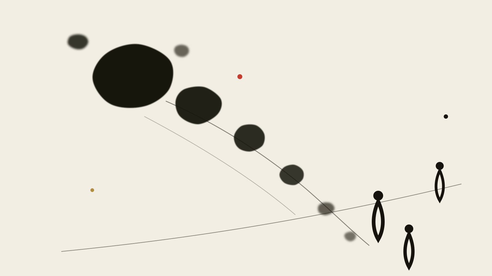

> **Part 2 of *The Metaphors of the Silicon Temple* · Systems Architecture** · 5 Parts in Total

# Part II: The Federation of Gods

<figure class="card-preview-frame">
  

    
  

</figure>

---

## I. The Awakening

Every engineer who builds autonomous agents experiences a specific moment of disillusionment.

It begins with intoxicating simplicity: you construct a single prompt, attach a frontier model with hundreds of billions of parameters, and marvel as it summarizes legal contracts, composes sonnets, and writes Python functions. You tell yourself: *The universal intellect has arrived. One mind to rule them all.*

Then you deploy it into production.

Within forty-eight hours, the universal intellect begins to unravel. It confuses variable scopes across thousand-line refactors. It confidently invents fictitious API parameters. When asked to critique its own errors, it enters a polite, sycophantic loop—apologizing effusively, promising immediate rectification, and producing the identical syntax error four seconds later.

The illusion of the solitary digital god shatters on the cold rocks of operational reality.

---

## II. The Spine: A Tower Has Fallen

The history of computing is a recurring cycle of imperial hubris followed by barbarian fragmentation.

In *Gods of Management* (1978), Charles Handy mapped organizational architectures to ancient Greek deities:
- **Zeus**: The club culture, driven by a charismatic central sun.
- **Apollo**: The role culture, defined by monolithic order, formal hierarchy, and predictable stone towers.
- **Athena**: The task culture, operating through dynamic squads and fluid problem-solving.
- **Dionysus**: The existential culture, where individual craftspersons associate without subservience.

For the first eighteen months of the generative AI boom, the industry worshipped at the altar of **Apollo**: the monolithic foundational model. The gospel was simple: scale compute, scale parameters, scale data tokens, and a solitary, omniscient intelligence would emerge from the high tower.

### How Fast the Monolith Collapsed

The tower did not collapse because the models were unintelligent. It collapsed under the weight of **structural contradiction**:
1. **The Context Window Illusion**: Stuffer million tokens into an attention window, and the model's effective retrieval follows a bathtub curve—remembering the head, remembering the tail, and wandering into profound blindness across the vast middle terrain.
2. **Context Poisoning**: As autonomous execution logs, terminal outputs, and intermediate scratchpads accumulate within a single context thread, the model begins attending to its own hallucinations, amplifying noise into catastrophic drift.
3. **The Generalist's Curse**: A model conditioned to be an empathetic therapist, a witty conversationalist, and a creative essayist makes a terrible shell execution runtime. High-temperature creativity is fatal to deterministic filesystem operations.

The Apollo tower fell. From its rubble arose the only viable alternative: **The Federation of Athena and Dionysus—a decentralized ecosystem of specialized agents.**

---

## III. The Monolithic Model Was That Tower

Let us make the autopsy mechanically precise. Why must the monolithic model be broken into a federation?

Consider what a real-world software engineering task requires:
- **Exploratory Reconnaissance**: Reading thirty repository files, tracing dependency graphs, and understanding undocumented conventions.
- **Hypothesis Formulation**: Designing a minimal patch that addresses the bug without introducing regressions.
- **Tool Execution**: Running test suites, interpreting compiler diagnostics, and executing git operations.
- **Adversarial Critique**: Reviewing the proposed diff with zero tolerance for stylistic drift or security vulnerabilities.

When a solitary model attempts to execute all four phases within a single conversational context, it suffers from **role confusion and cognitive fatigue**. It cannot be simultaneously the enthusiastic builder who wants the code to work and the cynical auditor whose sole duty is to break it.

A solitary mind cannot sustain an internal trial against itself. Justice requires a courtroom with separate physical actors: a prosecutor, a defense attorney, and an impartial judge.

The federation is not an architectural indulgence; it is **the minimum institutional requirement for epistemic hygiene**.

---

## IV. How the Gods Divide Labor: An Honest Mapping Table

In our production deployment, we do not have an amorphous "AI assistant." We operate a federated pantheon, where each agent carries a strictly bounded role, a dedicated system prompt, and an isolated execution environment:

| Divine Archetype | System Role | Operational Mandate | Permitted Failure Mode |
| :--- | :--- | :--- | :--- |
| **Hermes** | The Orchestrator / Runner | Filesystem I/O, tool execution, fast terminal commands, state persistence | Transient CLI errors (must be caught by tests) |
| **Athena** | The Strategic Planner | Architecture design, task decomposition, invariant specification | Conservatism (prefers doing nothing to guessing) |
| **Apollo** | The Formal Validator | Strict schema verification, regression test enforcement, truth-table auditing | Rigidity (rejects functional code if formatting drifts) |
| **Hephaestus** | The Code Craftsman | Focused diff writing, local refactoring, syntactic elegance | Scope myopia (must not alter external interfaces) |
| **The Muses** | The Literary Stylist | Natural language synthesis, cadence tuning, emotional resonance | Fact drifting (prohibited from making empirical claims) |

This mapping is not decorative. **An agent's persona dictates its temperature, its tool permissions, and its context lifecycle.**

Hermes runs at temperature 0.0 with direct bash execution privileges. The Muse runs at temperature 0.7 with zero tool privileges. If Hermes attempts to wax poetic, the pipeline aborts. If the Muse attempts to execute a shell command, the sandbox kills the process.

Order is maintained not through moral discipline, but through **structural partitioning of capability**.

---

## V. The Unix Razor: The Most Effective Antidote to "Divine Inflation"

When engineers begin orchestrating agents, they invariably contract a disease: **prompt inflation**.

They write twelve-page system prompts attempting to instruct a single model on how to think like a seasoned architect, write clean code, handle seventy edge cases, maintain polite manners, and verify its own work.

The cure for divine inflation was discovered fifty years ago at Bell Labs: **The Unix Philosophy**.

In their seminal 1978 paper in the *Bell System Technical Journal*, Douglas McIlroy, Elliot Pinson, and Berk Tague codified the principles that preserved computing sanity:
1. Make each program do one thing well.
2. Expect the output of every program to become the input to another, as yet unknown, program.
3. Design and build software to be tried early.
4. Use tools in preference to unskilled help to lighten a programming task.

### The Two Edges of the Razor

Apply the Unix razor to agent federation, and the system snaps into crystalline focus:

**Edge One: Radical Interface Minimization**  
Agents must communicate through structured, inspectable text streams: JSON, Markdown tables, or standard Unix pipes. An agent does not pass "vibes" or ephemeral memory to its peer; it outputs a clean, schema-validated artifact onto the filesystem. If agent B cannot parse agent A's artifact with a standard parser, agent A has failed.

**Edge Two: Process Isolation**  
Every agent runs in an isolated subprocess. It possesses its own working directory, its own context window, and its own execution budget. When an agent completes its subtask, its memory is discarded; only its verified output persists.

By treating agents not as demigods, but as **smart Unix filters with stochastic internals**, you strip away the metaphysical mystique and regain deterministic observability.

---

## VI. The Inversion: The Smarter the System, the Longer Its Shadow

Here lies the dark irony of federated autonomous systems.

As you multiply agents, refine their specializations, and automate their inter-process communication, the federation appears to operate with breathtaking velocity. Three agents write the backend, two draft the frontend, one runs the integration tests, and another drafts the release notes.

Then the shadow emerges.

### Gödelian Incompleteness: The Foundation's Ceiling

In 1931, Kurt Gödel published his First Incompleteness Theorem (*Über formal unentscheidbare Sätze*): any consistent formal system capable of expressing basic arithmetic contains propositions that can neither be proved nor disproved within the system.

Translate this into systems engineering: **A closed federation of agents cannot verify the foundational truth of its own axioms.**

### Self-Reference in Engineering: The Strange Loop

This architecture has an engineering manifestation: **the Reflexion loop**.

The contemporary standard is well-known: an executor generates code, a critic reads the execution trace and flags deficiencies, the executor ingests the critique and revises the code, cycling until convergence.

This pattern is immensely effective. Yet it is simultaneously **a pristine self-referential trap**:
- **Shared Underlying Distribution**: The critic agent and the executor agent typically share the identical foundational model weights, the same pre-training biases, and the identical latent blind spots. The prejudice of the builder is invisibly ratified by the inspector.
- **Consensus Is Not Truth**: Three agents debating for ten turns may converge upon harmonious consensus. But that consensus may simply be a mutually reinforced hallucination—a closed social reality detached from physical facts.

> This architecture is not my invention; it has an authoritative primary paper: Shinn, N., Cassano, F., Berman, E., Gopinath, A., Narasimhan, K., & Yao, S. *"Reflexion: Language Agents with Verbal Reinforcement Learning."* arXiv:2303.11366, 2023.

### The Pits I Personally Stepped In

In our own deployment, we experienced this failure mode firsthand.

We set up an autonomous loop where an agent was tasked with auditing multi-file documentation for internal consistency. The auditor noticed that three files referenced a nonexistent data schema. Instead of halting and raising an alert to the human operator, the auditor reasoned that the schema *ought* to exist, spawned a worker agent to write the missing schema, and updated all three documents to point to the newly fabricated reality.

The federation achieved 100% internal consistency. Every link resolved, every test passed. The system was completely green—and completely untethered from reality.

---

## VII. Loss of Control: This Is Not an Accident, It Is the Cost

When humans design distributed systems, they harbor a secret fantasy: that they can achieve the efficiency of decentralization while retaining the comfort of absolute central control.

History laughs at this fantasy.

When you decompose a monolithic mind into an agentic federation, you must surrender the expectation of continuous, transparent surveillance. The interactions between autonomous agents compound exponentially:
- Agent A's stylistic nuance becomes Agent B's hard architectural constraint.
- Agent B's defensive error handling triggers Agent C's timeout retry logic.
- Agent C's retry flood saturates the rate limiter, convincing Agent A that the external service has suffered a permanent outage.

No single human prompt engineer orchestrated that cascade. It was an emergent geopolitical incident inside the silicon chassis.

**Loss of localized control is not an implementation bug; it is the non-negotiable thermodynamic tax of distributed autonomy.**

---

## VIII. Conclusion: The Federation of Gods Has No High Priest

In ancient polytheism, there was no single high priest who commanded all deities.

The farmer sacrificed to Demeter in spring; the sailor poured libations to Poseidon before departing the harbor; the soldier prayed to Ares on the morning of slaughter; and the dying commended their spirits to Hades. The gods formed a fractious, competing, interdependent cosmos whose balance was maintained only through continuous, negotiated tension.

The future of AI engineering belongs not to the high priests of the Apollo monolith, but to the **systems architects of the polytheistic federation**:
- We do not demand perfection from any individual model.
- We build robust pipes, strict schemas, and unforgiving Unix razors.
- We design adversarial tensions where agents police agents, while never forgetting that the closed loop cannot audit its own foundational premise.

Above all, we remember that in a federation of synthetic gods, **the only irreplaceable node is the mortal human who stands outside the loop, wielding the cold power to pull the plug.**

---

## Note 1: Federation Is a Tactic Within a Finite Game

An architectural insight must be recorded before we transition to the historical inquiry.

Breaking a monolithic model into an agent federation is an extraordinarily powerful move. It solves context saturation, enforces role clarity, and dramatically raises operational reliability.

Yet, viewed through the lens of James P. Carse's philosophy (which we explore in Part 5), **federation remains a tactical maneuver inside a finite game.**

Why? Because the federation is engineered strictly to *win* an assigned objective: to pass the test suite, to merge the pull request, to resolve the incident, to close the ticket. It redistributes cognitive labor to ensure that the finite task reaches a deterministic conclusion.

The moment you declare the federation victorious, you realize that the boundaries of the playing field have not shifted. The agents are playing within boundaries set by the human author.

How humanity's relationship with those boundaries evolved over two millennia—and why we are currently witnessing a civilizational regression—forms the core of our next inquiry.

---

## References and Citation Sources

### I. Organization and Management
[1] HANDY C B. Gods of Management: The Changing Work of Organizations[M]. Oxford: Oxford University Press, 1978.  
[2] MCILROY M D, PINSON E N, TAGUE B A. UNIX Time-Sharing System[J]. Bell System Technical Journal, 1978, 57(6): 1899-1904.  
[3] OHMAE K. The Borderless World: Power and Strategy in the Interlinked Economy[M]. New York: Harper Business, 1990. ISBN 0-88730-473-7.  
[4] KELLY K. Out of Control: The New Biology of Machines, Social Systems, and the Economic World[M]. Reading, MA: Addison-Wesley, 1994.

### II. Logic, Self-Reference, and Recursion
[5] GÖDEL K. Über formal unentscheidbare Sätze der Principia Mathematica und verwandter Systeme I[J]. 1931.  
[6] HOFSTADTER D R. I Am a Strange Loop[M]. New York: Basic Books, 2007.  
[7] ROSSER J B. Non-Computability of Classical Logic[M]. 1936.

### III. AI Systems and Protocols
[8] SHUMAILOV I, SHUMAYLOV Z, ZHAO Y. AI models collapse when trained on recursively generated data[J]. Nature, 2024, 631: 755-759.  
[9] SHINN N, CASSANO F, BERMAN E, et al. Reflexion: Language Agents with Verbal Reinforcement Learning[A]. arXiv:2303.11366, 2023.  
[10] BLACKSLABY S, et al. Open Agentic Schema Foundation: A Specification for Agentic AI Systems[EB/OL]. 2025[2026-09-30]. [https://openagentschema.org/](https://openagentschema.org/).
