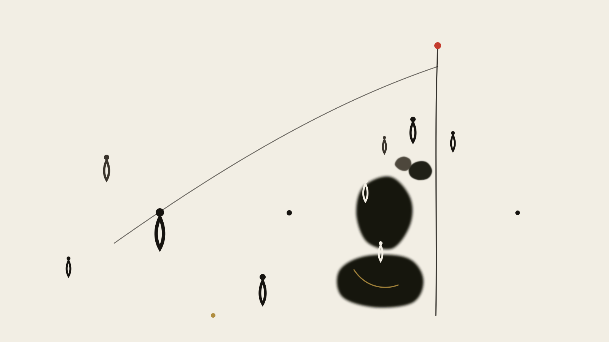

> **The Metaphors of the Silicon Temple, Part 3 · Civilization & History** · 5 Parts in Total

# Part III: The Reversal of the Axis

<figure class="card-preview-frame">
  

    
  

</figure>

---

## I. Socrates' Last Day Out

In 399 BCE, Athens. A trial, the charges being "impiety" and "corrupting the youth."

In the *Republic*, Plato records the outcome of this trial: Socrates was found guilty and sentenced to death. And according to the account Plato gives in the *Phaedo*, on the day of the execution Socrates was still discussing with his students "whether the soul continues to exist after death."

**One of the reasons he was sentenced to death was that he kept on asking questions.**

Specifically, that he asked "What is justice?" The trouble with this question is that it has no acceptable answer. To say "might is right" is to underwrite tyranny; to say "convention is justice" is to sanctify the status quo; to say "I do not know" is, in the political arena of the city-state, equivalent to not existing.

And in this very same book, Plato arranges an earlier scene — **the cave**.

A cave, in which the prisoners are locked from birth, their necks unable to turn, able to see only the shadows flickering on the wall directly in front of them. They do not know that these are shadows cast by a torch on the wall; they take them to be the whole of reality. Until one breaks free of the chains, crawls out of the mouth of the cave, and turns back to see the sun.

***Republic*, Book VII, 514a–520a.**

The reason the allegory of the cave has circulated for twenty-four hundred years is that it turns an abstract cognitive situation into a physical scene: shadows, firelight, crawling, turning around, the eyes stung by light.

**What I want to say today is: AI is becoming that shadow.**

No, somewhat more complex than a shadow. AI is not an image on the wall mistaken for reality — it is **an automated version of the projection that the human mind casts onto the wall of itself**.

This piece moves more slowly than that framing. What I want to say is: when, in the history of the human mind, did the impulse to "crawl out of the cave" first arise; why that event came to be called the Axial Age; and what is now happening to that event.

---

## II. The Spine: Jaspers' Vertical Axis

In 1949, the German philosopher Karl Jaspers published *The Origin and Goal of History* (*Vom Ursprung und Ziel der Geschichte*), in which he proposed a concept that has since been repeatedly cited and repeatedly challenged: **the Axial Age**.

His definition is simple: between 800 BCE and 200 BCE, in several mutually unconnected regions, a mental mutation took place almost simultaneously. In Greece there were Socrates, Plato, Aristotle; in China there were Confucius, Laozi, Mozi, Mencius; in Israel there were the prophets; in ancient India there were the Upanishads and the śramaṇa movements; in Persia there was Zoroaster.

**What do they have in common?**

One of the words Jaspers uses is the **"vertical axis"** (*vertikale Achse*). His observation is this: before the Axial Age, the connections of the human mind were mainly **horizontal** — the lateral bonds of tribe, totem, myth, and community. A person belonged to some myth, and that myth explained everything.

The transformation that occurred in the Axial Age is this: the human mind began to ask **upward**.

- Myth says: there is thunder in the sky; Zeus is angry.
- The Axis says: what is the fundamental principle of nature?
- Myth says: the souls of the ancestors are somewhere.
- The Axis says: what happens to consciousness after death?
- Myth says: we are the creation of some god.
- The Axis says: how should we live?

**From "myth explains everything" to "questioning everything."** From lateral connection to vertical ascent. Jaspers holds that this leap was not invented by any single region but was accomplished independently by several civilizations — which is why it looks less like the result of diffusion and more like a change that was bound to occur in the structure of the human mind at a certain stage.

**This concept is contested.** The criticism comes mainly from two points: first, the term "Axis" carries a strongly Eurocentric frame, forcing all civilizations into a single time window; second, the judgment that it was "simultaneous" is weakly supported by the evidence of historiography. Part 4 will return to this criticism.

**For now, accept its force.** The image of the vertical axis is enough to carry this entire piece.

---

## III. The First Ascent: The Cave

Back to Plato.

The structure of the allegory of the cave can be broken into three steps:

**Step One: the shadow stage.** The prisoners can see only the flickering play of light and shadow on the wall. Not only do they not know that these are shadows; **they do not even know that they do not know.** They have no channel for doubt, because doubt requires the concept of "there is something else that can be doubted" — and all they have in their hands are shadows.

**Step Two: the turning-around stage.** One man breaks free. He turns around, faces the cave wall and the fire, and sees for the first time that "the shadow is a shadow, and the source is fire." This step is painful and overturning — what he sees directly negates all the experience that came before it.

**Step Three: the exit stage.** He crawls out of the mouth of the cave and sees the real world outside. But here is a detail Plato writes with a certain cruelty: **the eyes are stung by the sunlight, and the first reaction is that "the shadows are more real than the truth."** He would rather stay in the cave.

**These three stages correspond to a complete cycle of cognitive transformation.** Shadow (no self-awareness) → turning around (coming to know that one has been wrong) → exit (seeing the real, but unable at first to bear it).

And what I am going to say today is this: **the shadow stage is becoming automated.**

---

### How the Shadow Was Automated

The shadows in the cave have a precondition: **someone must be holding a torch outside the cave.** The shadow is the projection of human cognitive activity onto the wall — it depends on the existence of persons, on human choice, on human intention.

**And the large language model is the automated realization of this projection.**

This analogy needs to be stated clearly, or else it sounds too mystifying:

- The model does not produce shadows — the model produces **statistical descriptions of shadows**. It has learned, from all of humanity's text, "what a shadow usually looks like."
- More crucially: it presents **all the possible shadows** to you at once. In the same second it can tell you "this is what the shadow of this field looks like" and "this is what the shadow of the other camp looks like," with phrasing on both sides equally fluent and equally confident.
- A human being needs a lifetime, a painful turning around, and crawling out of the mouth of the cave to be released from a single shadow. **The model compresses this whole path into a single question.**

**This is why we feel that we "know more than we understand."**

The chasm between knowing and understanding was, in the cave, physical — you had to crawl. But in the age of the model it has become zero-cost: you can at any moment ask something that looks as if it understands everything.

**And this is precisely the sharpest point of the Cave metaphor:**

The reason the prisoners in the cave are trapped is not that they are lazy. It is that **within the cave the shadow is a complete reality, and it is self-consistent.** It does not need you to believe anything; it is simply there, and it looks real.

The answer the model gives is exactly such a self-consistent system inside the cave. It is fluent, internally consistent, and able to respond to any question.

**The problem is not whether the answers it gives are true or false. The problem is that it has compressed to zero that crawling distance between "knowing" and "understanding."**

And that distance is exactly the place where understanding comes about.

---

## IV. The Second Ascent: The Digital Tower of Babel

The cave is the metaphor of the first ascent.

But human beings have never stopped climbing upward. After the Axial Age — the Middle Ages, the modern era, the Enlightenment — every great leap has been accompanied by a direction "upward": purer reason, higher knowledge, larger organization.

**And today, this direction has reached a material form without precedent.**

I call this form the **Digital Tower of Babel**. The name comes from Genesis, chapter 11.

### The Structure of the Original Text of Genesis 11:1–9

> "Now the whole earth had one language, and they all spoke the same words...
> They said, 'Come, let us build a city and a tower whose top reaches the heavens, so that we may make a name for ourselves.'
> The LORD said, 'See, they are one people, and they all have one language; and what they have begun to do — what they have started, they will surely finish.'
> So the LORD came down from heaven to look upon the city and the tower that the people were building...
> The tower was left unfinished, because in the building the language of the people was confused. So the LORD confounded their tongues, so that they could not understand one another... The city was called Babel (confusion)."

**The structure of this text deserves close attention.**

Humanity's motive for building the tower was not defense, not production, not dwelling. **It was "to make a name for ourselves."** The purpose of the tower was self-referential from the start — it was not to reach some place, but to let others know that we are here, that we have done this.

And its ending is **the confusing of language**. It is not that the tower was destroyed; it is that **communication failed**.

**This point is especially important for understanding the AI age, because it differs from the popular imagination of "Babel."** Most people remember the act of "reaching the heavens" — the vertical, upward ambition. But the punishment in the Genesis text is not "you may not climb up," but "you will not be able to understand one another."

**If we are to find a Babel narrative for the digital age, the more accurate formulation is not "human beings have built another tower that reaches the heavens," but rather "human beings are building something that makes a name for itself, and inside it is becoming impossible for them to understand one another."**

---

### The Four Characteristics of the Digital Tower of Babel

Back to the actual state of the AI age. When a system is designed to "understand every language, master all of human knowledge, and speak in the name of humanity," it structurally reproduces every element of the Tower of Babel:

**One, the languages of the whole world, a single tower.** The training data is the text of all humanity — every language, every era, every discipline beaten into a single whole.

**Two, the purpose is self-referential from the start.** The model's self-reference takes a hidden form: it is trained to generate things "like a human being." It is not to make the name of some one person; it is to let the concept of "the human" extend without limit inside it.

**Three, the ending is confusion — and it is already happening.**

I will say this one concretely, because it is verifiable:

- **Contamination of the training data:** as model-generated content goes online, the training data of the next generation of models has the output of the models mixed into it. This is a real problem that has already occurred.
- **The disappearance of languages:** large numbers of low-resource languages are systemically degrading inside the model because they have insufficient data — not "understood a little poorly," but "they simply do not appear in its expressive capacity at all."
- **The loss of veracity:** the most serious problem. When retrieval-augmented generation (RAG) is used at large scale, a "cited source" is increasingly likely to be "the output of another model" — the chain of sources begins to loop back on itself. Facts no longer flow toward knowledge; they flow toward the model and out of the model again.

**Four, the consequence is not destruction but mutual unintelligibility.** Today two people working with different models, faced with the same question, get two different answers. Two people using the same model get nearly identical answers. **This means: consensus comes from a shared model, not from a shared understanding.**

**Sharing a model and sharing an understanding are two entirely different things.**

The former is technical unification; the latter is cognitive unification. Technical unification is happening; cognitive unification is not.

**The curse of Babel is not that it is torn down, but that it becomes a cluster of cities, each speaking its own different dialect.** Each city is very powerful, and every city believes it is speaking the standard language.

---

### But an Honest Distinction Must Be Made Here

About this text of Genesis, a common misreading must be pointed out: **the Babel of Genesis and the Greek tower that reaches the heavens (the myth of Prometheus, the two towers of Taled) are not the same story.** In Genesis, God descends from heaven to look; the tower does not in fact reach the heavens; it is a story of moral failure (pride). In the Greek tradition, climbing the tower is heroism (though at a cost).

**These two traditions have long been entangled in Western culture, but they point to different things:** one says "do not climb up," the other says "climb, but you will pay a price." And the contemporary AI narrative twists the postures of both together: it wants both to reach the heavens (the imagination of AGI) and, at the same time, half-hopes for punishment (anxiety about AI safety).

**Making this clear is far more useful than treating Babel as a simple symbol.**

---

## V. The Third Refusal: Laozi's "Small State with Few Inhabitants" and Schumacher's "Enough"

Now we reach the place this piece is actually trying to get to.

The cave (climbing upward), the Tower of Babel (climbing partway, or climbing too greedily) — after these two segments, there is still a very different voice.

**The Dao De Jing, Chapter 80.**

> A small state with few inhabitants. Though there be tools that can do the work of ten or a hundred men, let them not be used; let the people so value their lives that they will not migrate far. Though there be boats and carriages, let there be nowhere to ride in them; though there be armor and weapons, let there be nowhere to display them. Let the people return to tying knots in cords for counting. Sweet to them their food, fine to them their clothes, comfortable to them their homes, pleasing to them their customs. Though the neighboring states be in sight of one another, and the cries of their chickens and the barking of their dogs be heard across the border, let the people live out their lives to old age and die without ever visiting one another.

In the contemporary period, the most frequently quoted part of this passage is the last four sentences. Though the neighboring states are in sight of one another and the cries of their chickens and the barking of their dogs are heard across the border, the people live out their lives to old age and die without ever visiting one another. **Almost everyone quotes it, but almost everyone takes it to be saying "closedness" and "backwardness."**

**But that is not what Laozi is saying.**

This is a complete picture of life in a "small state with few inhabitants." It has a complete system of supply: tools of ten or a hundred (advanced hand tools), boats and carriages (vehicles and ships), armor and weapons (military force), tying knots in cords for counting — all of it technology. It simply is not used. "Though there be" — **the tools exist; they are just not used.**

**There is a very subtle distinction here: Laozi is not anti-technology, but anti the scaling and coercion of technology.** What he wants is not the absence of tools, but that tools do not become the dominating force of life.

And "the neighboring states in sight of one another, the cries of their chickens and dogs heard across the border" — this is a sentence about **the depth of relations.** To be able to hear your neighbor's dog bark means your residential density is close enough to hear the other's voice — but "the people live out their lives to old age and die without ever visiting one another" means you **almost never initiate contact**.

**This is a relation of "near but not intrusive."** Each can feel the other's presence, but neither need intervene in the other.

In Chapter 74, Laozi says something more blunt: "If the people do not fear death, how can you frighten them with death?" — when people are not afraid of dying, it is of no use to threaten them with death.

**This is the core insight about governance: when you can use force to unify everyone, what you get is not order but subjection.** The subjected produce nothing; they collapse the moment the pressure is removed.

---

### Laozi Had a Western Colleague

If we read "Laozi's small state with few inhabitants" as "Eastern wisdom versus Western arrogance," we have reached the cheapest kind of binary opposition.

**In 1973, a German economist living in Britain did something similar.**

E. F. Schumacher published *Small Is Beautiful: A Study of Economics As If People Mattered*. The core criticism of his book is this: the objective function of modern economics is wrong — it pursues GDP growth, and growth itself has no purpose. The alternative Schumacher proposes is "the economics of sufficiency" (economics of sufficiency) — it asks not "how much at most can be produced" but "how much is enough."

**There is a well-known passage in his book (paraphrased):** people at the time were experiencing a kind of "worship of the colossal" (idolatry of gigantism).

**The title of Schumacher's book comes from the view of his teacher Leopold Kohr** (this point is still to be verified). Small in scale, decentralized, within human reach — these lie on the same thread.

**Laozi and Schumacher are separated by two thousand years, one in East Asia, the other in the West.** Yet the direction of their arguments is two faces of the same thing:

- What Schumacher criticizes is **the objective function of economics** (why must we always grow?)
- What Laozi criticizes is **the relationship to technology** (why must tools become the dominion of life?)

**They are not one person saying it twice; they are two civilizations each arriving independently at the same negation.** This is the part worth stating — not because East and West reach the same conclusion by different paths (that is still just the packaging of a binary opposition), but because **the negation is not the special product of any one culture.**

---

### A Difficulty That Must Be Admitted

But before acknowledging this, I have to make clear a difficulty.

**Laozi and Schumacher were both writing in an age we are not in.** The problem they faced was "the worship of the thing" (Schumacher's "worship of the colossal") and "technology becoming the dominion of life" (Laozi's tools of ten or a hundred), and the problem we face is more than that.

What we face is something **at once extremely useful and extremely dangerous**: a small-state-style edge AI system that is **natural with respect to** scaling but **ruthless with respect to** the actual needs of human beings. Schumacher's "enough" presupposes that "enough" is desirable — but what if an edge system simply cannot meet my actual need?

**Laozi's and Schumacher's schemes share a common premise: that the local is enough.** That premise held for an agricultural society; it does not hold for the complex technical systems of today.

**And that premise is, in fact, being re-verified today — in a form they did not foresee.**

Edge models, LoRA fine-tuning, local knowledge bases, private data: there is today a real, verifiable technical trend pointing to "the local is enough." Not "I do not need large models," but "I do not need to hand everything over to the remote end."

**This is plainer than anything Laozi said: you do not need everything to be small, you only need a part that does not depend on the center.**

**This is not a proof of Laozi. It is a technical fact.** Edge computing today is verifying this direction, partly out of cost, partly out of privacy, and partly out of the fear of a centralized single point of failure.

---

## VI. McLuhan's "Tribal" and the Misused Word

The cave, the Tower of Babel, the small state with few inhabitants — these three segments form the skeleton of this piece. But there is one more thread that does not sit inside any of the three; it sits between them.

**In the 1960s, McLuhan prophesied that electronic media would "explode" humanity back into the tribe.**

Concretely: the printing press, reason, individualism, the nation-state — these are all products of "literate civilization." And the defining characteristics of electronic media are immediacy, irreversibility, and global synchronization. It makes no distinction between languages, between cultures, between time zones.

McLuhan's judgment is this: electronic media will push humanity back from "literate civilization" into "tribalization." **We think we are heading toward the global village; in fact we are heading toward a set of tribes that do not visit one another.**

**But I must here correct a widely spread misuse.**

The word "retribalization" **is not McLuhan's.** It is an early political term of the American indigenous self-determination movement, appearing at the end of the 1960s. McLuhan used "tribal"; *retribalization* is an addition by later writers.

This difference is not academic pedantry; it has substantive consequences: a concept originally used to describe "the political self-determination of indigenous peoples" is now being used to describe "all of humanity shattered by media into small groups" — **this is the operation of abstracting a concept from its specific historical situation and turning it into a universal metaphor, and that abstraction is itself part of the problem.**

---

### The Concrete Form of Tribalization in the AI Age

In the AI age, "tribalization" takes a more concrete, more observable form: **algorithmic tribes.**

A new kind of tribe is forming. It is based neither on bloodline nor on geography, but on **model preference**.

Two different people, using the same model and asking the same question, get nearly the same answer. Between them a new kind of community is generated — not "we think alike," but "we are shaped alike by this model."

**This sounds like shared understanding; in fact it is shared bias.** Because what you share is not the judgment but the mold in which the judgment is cast.

**And the more dangerous layer is this: the tribes cannot communicate with one another.** Because one tribe shares the way of speaking of one model, and another tribe shares that of another. **Language is no longer unified, but it is not the confusion of "being confounded by God" either — it is that everyone is speaking a standard language, and there are N standard languages.**

Genesis speaks of "confounding the tongues" so that people cannot understand one another. The situation in the AI age is more subtle: **we all understand one another, but what we are hearing are different standard languages.**

**This is a new Tower of Babel, but not the result of a curse; it is the result of optimization.**

---

## VII. Conclusion: Three Moments, None of Them Disposable

The cave, the Tower of Babel, the small state with few inhabitants — three histories.

**The cave** is the first ascent: the first time human beings realized that what they saw might not be the whole, and were willing to pay a price for it. In Plato's version, the one who crawls out of the cave still at first feels the shadows are more reliable than the real — **the starting point of any cognitive transformation is first to doubt what one is seeing.**

**The Tower of Babel** is the failed version of the second ascent: humanity tried to unify the world with some single structure, and the ending was not destruction but mutual unintelligibility. The lesson of this segment is this: **unification and communication are two different things.** You can have a perfect structure, and the people inside the structure still will not understand one another.

**The small state with few inhabitants** is the refusal of a third ascent: it is not that one cannot climb, but that one does not necessarily must. And this refusal is not a concession; it is an argument — it argues that the local is enough, and that "enough" is the highest-order goal.

**The AI age is doing three things at once.**

It is automating the shadows (first segment: knowing ≠ understanding; the distance goes to zero). It is building a tower that makes a name for humanity, while inside the tower things are being confounded (second segment: consensus comes from the model, not from understanding). And it is also making "the local is enough" for the first time a technically feasible option (third segment: edge, private, bounded).

**Three things happening at the same time, and all caused by the same thing. This is the first time that has happened.**

**So the real question is not "should we climb or not."** That question was already asked in the cave; the answer is to climb — otherwise you never know that what you are seeing is a shadow.

**The real question is this: now that we finally have the technology to climb, will the light at the mouth of the cave be merely another set of more refined shadows?**

Plato says it clearly: the one who leaves the cave will at first think the shadows are more real. This is not a failure of his allegory; it is his experience.

**Today's risk is not that "there is no light outside the cave." Today's risk is that "the shadows have learned to emit light too."**

And the deeper unease is this: when the shadows begin to emit light, the language we use to explain them is itself part of the shadows. The Axial Age left us a transcendent questioning and a taxonomy, but when these tools face a non-living entity that can generate grammar and reasoning on its own, the axial framework is either too slow or too light.

The ladder by which civilization climbs upward has snapped, and we cannot even be sure that we, who remain on the ground, are really still living. This is no longer a grand narrative of historiography or of the philosophy of civilization; it shatters, in the very next second, against the private experience of every single user: when the machine claims that it understands, what on earth are we talking to?

---

## Appendix 1: Babel Was the First Time an Infinite Game Was Played as a Finite One

What this piece writes about is the vertical axis of civilization — three climbs: Plato's cave (the shadow), the Babel of Genesis (the confounding of tongues), Laozi's refusal to climb (not building). **And when Part 5 looks back, it will find that this Babel segment is actually about something else.**

In *Finite and Infinite Games* (Free Press, 1986), James P. Carse distinguishes two kinds of rules: the rules of a finite game exist to guarantee that the game ends; the rules of an infinite game exist to guarantee that it does not end.

Genesis, chapter 11: humanity says, "Come, let us build ourselves a tower whose top reaches the heavens, so that we may make a name for ourselves." **Note the motive — not to reach the heavens, but to make a name.** And the punishment is not that the tower is destroyed; it is that **the language is confounded.**

**A complete form of a finite game, written down as a story.** The goal is a measurable achievement (a tower that reaches the heavens); the participants are a closed set (people of the same language); the rule is uniform (building together); the ending condition is reaching the height. And the reason it fails is structurally very clear: **a unified name requires a unified external vantage point to recognize it, and that vantage point does not exist.**

**Seen from the frame of Part 5: this is a finite game attempting to give itself the status of an infinite game.** The builders wanted the game to go on forever — because once the tower is built, the act of "building the tower" loses its only meaning. So they must make it infinite. **And a tower whose purpose is to make a name — its very existence is the end of the game: on the day it is completed, all participants' scores are zeroed at once.**

So the punishment of Babel is structurally exact: **the confounding of tongues did not punish the tower; it took away the possibility of "continuing."** The game can neither end nor continue; it is stuck in an intermediate state — **this is an earlier version of the Huxleyan ending that Part 5 describes, except that it happens at the level of language rather than at the chemical level.**

**And the Laozi section of this piece, under the same frame, changes meaning too.** The tools of ten or a hundred that Laozi opposes are "among all things they arise; some take profit from them, and so they die" — **a thing that is made, and around which everyone then organizes their life.** This is exactly the same thing as what Section 7 of Part 5 describes: **human life-activity (the infinite game) is locked into the finite box of a man-made thing.**

Thus the three climbs, under this frame, become a more regular structure: the cave is **a mis-seeing** (taking the shadow for the world); Babel is **a mis-making** (making a thing that ought to be infinite and setting it an end); the small state with few inhabitants is **a refusal** (not wanting this box). And the position we stand at today is a fourth possibility — **we have already made that thing, but it refuses to end.**

---

## A Place That Requires Caution

**There is one place in the argumentative structure of this piece that I must mark: it has made a structured juxtaposition of three historical narratives of different natures.**

The cave (Plato, philosophical allegory), the Tower of Babel (Genesis, religious text), the small state with few inhabitants (Dao De Jing, political philosophy) — these three are not the same thing. My juxtaposing them is **my structural operation, not a connection between them in history.**

**What I am not trying to say is that "the ancients had long foreseen AI."** What I am trying to say is this: a problem that each of these three segments resolves on its own has, in the AI age, appeared at the same time — and because they have appeared at the same time, human beings need a new posture, and cannot directly apply any one of the three.

**Applying any one of them is dangerous:**
- To speak only of the cave is to underestimate the real capabilities the tool brings
- To speak only of Babel is to overestimate the value of unification
- To speak only of the small state with few inhabitants is to underestimate the necessity of complex systems

**So the conclusion of this piece is not that "we should return to a small state with few inhabitants," nor that "we should not build a tower."** The conclusion is this: the problems of all three segments each need a new answer, and that answer does not yet exist.

---

## Series Navigation

This is **Part 3 · Civilization and History** of *The Metaphors of the Silicon Temple*. The series has five parts: symbols and cognition / systems and architecture / civilization and history / consciousness and introspection / institutions and politics. This essay picks up the federated architecture of Part 2 and walks upstream in time: how was this division of labor repeatedly rearranged by an older axis — the distribution of center and periphery?

Previous: [The Federation of Gods](硅基神殿的隐喻_诸神的联邦.html) (Part 2 · Systems and Architecture)　　Next: [The Anātman and Language Games](硅基神殿的隐喻_无我者与语言游戏.html) (Part 4 · Consciousness and Introspection)

## References and Citation Sources

### I. Philosophy and History
[1] PLATO. Republic[M]. Book VII, 514a-520a (The Allegory of the Cave).
[2] PLATO. Phaedo; Apology[M].
[3] Jaspers K. Vom Ursprung und Ziel der Geschichte[M]. Bern: Piper Verlag, 1949.
[4] THE HOLY BIBLE. Genesis[M]. 11:1-9 (The Tower of Babel). Union Version.
[5] LAOZI. Daodejing[M]. Chapter 7, Chapter 80 (The Small State with Few Inhabitants). Wang Bi recension system.
[6] Weber M. Wissenschaft als Beruf[M]// Gesammelte Aufsätze zur Wissenschaftslehre. Tübingen: J.C.B. Mohr, 1922: 524-555.

### II. Economics and Sustainability
[7] Schumacher E F. Small Is Beautiful: Economics as People Matter[M]. London: Abacus, 1973.
[8] Kohr L. The Breakdown of Nations[M]. London: Routledge & Kegan Paul, 1957.
[9] Hines D A. Small Is Beautiful by E. F. Schumacher[J]. Journal of Economic Issues, 1975, 9(4): 866-883.

### III. Media Theory
[10] McLuhan M. Understanding Media: The Extensions of Man[M]. Cambridge, MA: MIT Press, 1994. ISBN 978-0-262-63159-4.
[11] Gorman R F. Revisiting Karl Jaspers's Axial Age Hypothesis: Natural Law as a Missing Link[J]. Chinese Sociology and Anthropology, 2015, 47(2).
