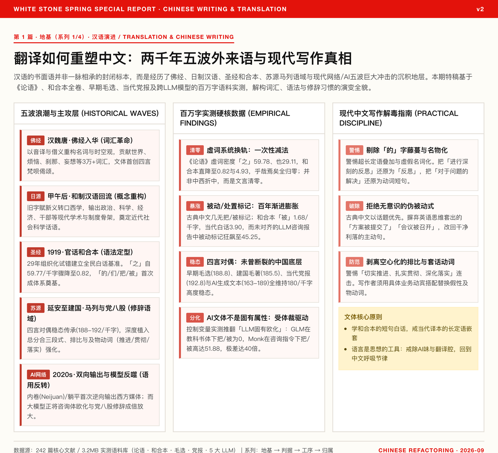

<figure class="card-preview-frame">
  <div class="card-img-wrap">
    <a href="../assets/翻译如何重塑中文_卡片图.html" target="_blank" title="点击打开全屏交互式卡片">
      
    </a>
  </div>
</figure>

---

## Introduction: The "Pure Chinese" We Take for Granted Is Sedimentary Rock Laid Down by Five Great Shocks

> **Where this piece sits in the series**: Piece 1 of the *Writing Series* — the foundation. The mother theme is "using writing to learn and develop yourself." But before learning to write, we must answer a plainer question first: is the Chinese we use natural-born, or was it manufactured? This piece spends two thousand years of time budget to level that foundation — not for the fun of philology, but so that the "criteria" of the next layer can stand on solid ground. On top of the foundation, Piece 2 will discuss how to judge whether a word is good, and Piece 3 how to turn other people's words into your own judgments.

A modern, educated Chinese person picks up the pen and writes the following work review:

> "In light of the serious problems exposed during the push-forward of this project, we must conduct a deep reflection, so as to actually implement various measures in the next phase of work, and ensure that the team's execution capacity is fully activated."

In these few dozen characters, nearly every word and every grammatical marker hides the layered geological folds left by waves of loanwords crashing in over centuries, even two thousand years:
- "project," "problem," and "reflection" come from Meiji-era Japan's transcriptions of Western concepts via **Japanese-made Chinese (wāzhì hànyǔ, wasei-kango)**;
- "push forward," "implement," and "ensure" carry the unmistakable imprint of the **Soviet-origin and Yan'an political-discourse register**;
- the attributive-clause structure of "various measures of" and the passive marker of "fully activated" are genes left by the modern direct translation of **Western European grammar** represented by the *Gospel of Matthew*.

We often dismiss "bookish European-ized sentences," "correct but empty talk," "AI-speak," or "translationese" as personal vices of the contemporary writer. But stretch the lens to two thousand years, and you will find: **the written Chinese language was never a pure, closed, static specimen; it is an evolutionary history of being continuously shattered, restructured, and hybridized by loanwords, and finally settling into modern everyday use.**

This is the first foundation block this piece lays: **the "vices" of writing are, more often than not, not vices at all — they are sediment.** To get rid of them, you must first recognize which stratum they come from. Only when you can recognize them can you talk about judgment, mechanism, and developing yourself — that is the work of the few pieces that follow.

To make clear where modern Chinese actually comes from, and where it has been carried to, we built a measured-test corpus of 242 core documents totaling 3.2MB (covering the *Analects*, the full volumes of the 1919 Union New Testament, Mao Zedong's early and post-founding-period works, contemporary government work reports, and generated text spanning 5 major mainstream LLMs), combining quantitative measurement with documentary research, to answer three questions:
1. In the two thousand years of loanwords crashing into Chinese, how many waves are there in fact? Which neural ganglion (layer) of Chinese did each wave strike?
2. What exactly did the "vernacular grammar" that began with the Bible's Union Version do in the modern era? Did it bring European-ization, or did it launch de-classicalization?
3. The "party-apparatus gongwen" and "AI translationese" that now flood the screens — who exactly rules them? How should modern writers detoxify their own prose?

---

## I. Five Waves Across Two Thousand Years: Which Layer of Chinese Did Each Strike?

History is full of the one-pot-stew misconception when it comes to loanwords' effect on Chinese — offhandedly lumping it all together as "Westernization" or "European-ization." But a decomposition based on etymology and corpus features shows that the five large-scale external inputs of the last two thousand years have **struck entirely different primary layers**:

```
Era Wave                    Primary Layer      Core Mechanism & Representative Sediment
────────────────────────────────────────────────────────────────────────────────────────
Wave 1 · Buddhist         Noun layer ★       Sound/semantic borrowing; injected 30,000+
   scriptures enter China                                nouns and a causal–temporal view of
 (Han–Wei to Tang–Song)                                  the world
                                                         E.g.: world, delusion, moment,
                                                         affliction, preaching by personal
                                                         example
Wave 2 · Wasei-kango      Concept layer ★    Old kanji bottles, Western scholarly new
   reflow                                                      wine; built the skeleton of the
 (post-1895 to May Fourth)                                   social sciences and academia
                                                         E.g.: politics, science, economy,
                                                         cadre, revolution, physics
Wave 3 · Bible Union      Grammar layer ★    29 years of organized trial and error;
   Version                                                     short-sentence vernacular fixed
 (1890s–1919)                                             the baseline of modern particles
                                                         E.g.: classical particles zeroed
                                                         out; "de / men / le / ba / bei"
                                                         became a system
Wave 4 · Soviet-origin    Rhetoric /        Russian long-sentence translation + Yan'an
   Marxist-Leninist        register ★        rectification, shaping the
   register                                              organizational-mobilization and
 (1920s–1950s)                                       political-essay styles
                                                         E.g.: four-character couplet
                                                         steady state, triple parallelism,
                                                         intensified transitive verbs
Wave 5 · Internet & AI    Pragmatics /      First-ever reverse output in 2,000 years;
   era                  bidirectional ★    LLMs multiply genre bias
 (2000s–present)                                      E.g.: Neijuan / Lie Flat spilling
                                                         over; LLM European-ization vs.
                                                         gongwen clichés polarizing
```

### 1. The Entry of Buddhist Scriptures into China: Reconstructing the Noun and Causal Universe

The Buddhist scripture translation movement from the Eastern Han through the Tang and Song was the first cross-civilizational encounter that Chinese faced. The translation masters Zhi Fahu (Dharmarakṣa), Kumārajīva, and Xuanzang faced Sanskrit — a precise inflectional language. Buddhism's most core modification to Chinese was an **expansion of the vocabulary and the conceptual universe**.

Xuanzang established the "five untranslatabilities" principle, but the deeper impact was the localization of Buddhist philosophical concepts by borrowing existing Chinese characters. According to Liang Qichao's statistics in *Translation Literature and Buddhist Classics*, the Buddhist scriptures contributed tens of thousands of new words to Chinese. The "world," "cause and effect," "reality," "relative," "equality," "clinging," "affliction," and "preaching by personal example" that we throw out casually today all come from the Buddhist scriptures.

At the same time, the **Sanskrit chants and gāthās (four-, five-, and seven-syllable rhymed verse)** brought by the Buddhist scripture translation not only greatly stimulated the development of Han–Wei–Six Dynasties parallel prose (pianwen), but also gave Chinese an extremely high tolerance for "four-beat rhythm."

### 2. The Reflow of Japanese-Made Chinese: Completing the Modern Academic Re-export via a Japanese Bridgehead

After China's defeat in the Sino-Japanese War of 1895, Chinese intellectuals launched a torrent of study in Japan. By then Japan had already undergone decades of Meiji Restoration; Fukuzawa Yukichi, Nishi Amanaga, and other Enlightenment scholars had used classical Chinese characters to translate a mass of Western philosophical and scientific works into Japanese.

In 1900, Liang Qichao published the stone-printed *Wawen Handufa* ("How to Read Japanese Texts as Chinese") in Japan, creating the unusual scene of "Chinese scholars reading Japanese kanji books directly." China did not directly transplant Latin roots; instead, through "Japanese-made Chinese" it completed a low-friction re-export:
- **Political institutions**: constitution, democracy, government, political party, republic, cadre, privilege;
- **Society and economics**: society, economy, finance, capital, investment, enterprise, consumption;
- **Natural and humanities**: physics, chemistry, biology, art, philosophy, psychology, logic.

The subtlety of Japanese-made Chinese lies in this: **the word forms look archaic and refined, but the concepts are brand new.** Chinese intellectuals, without realizing it, swapped out their underlying thinking model, and the cognitive framework of the modern disciplines was thereby fixed.

### 3. The Bible's Union Version: The Underrated True Foundation of Modern Vernacular Grammar

The *Mandarin Union Version* of the Bible, published in April 1919, was polished over 29 years, volume by volume and word by word voted on, by English and American missionaries from seven societies together with a number of Chinese scholars.

Literary history often credits the vernacular literature movement to Hu Shi's *A Crude Proposal for Literary Reform* and Lu Xun's *Diary of a Madman*. But as early as 1921, in *The Bible and Chinese Literature*, Zhou Zuoren said plainly:

> "The *Gospel of Matthew* is indeed China's earliest Europeanized literary national language... In the past two or three years the literary revolution has argued; after the demolition, construction should now begin. How should this new instrument of literature — the national language — be organized? I have recently found this remedy in the Bible translations."

Through its astonishing print run and its grassroots preaching, the Union Version established a nationwide consensus of vernacular accent. It was not an experiment in the scholar's study, but a vernacular grammar standard, hammered through a thousand refinements, that an illiterate farm woman could understand — a **vernacular grammar reference for the whole people**.

### 4. The Soviet-Origin Marxist–Leninist Register: The Welding-In of the Organizational-Mobilization Style

The translation of Marxist–Leninist works by Qu Qiubai, Chen Duxiu, and others in the 1920s opened a discourse system bearing the unmistakable coloring of Russian word order and political combat. Russian subordinate clauses are complex, verbal nouns are abundant, and logical parallelism is strict; translated into Chinese, this gave birth to a highly organized discourse norm.

In 1942, during the Yan'an Rectification Movement, Mao Zedong delivered the famous *Against Party Gengwen* ("Eight-Legged Party-Essay Style"), bitterly criticizing "pages of empty talk," "affected posturing," and "setting out a Chinese-medicine cabinet of A-B-C-D." Yet the irony is that this style, evolved from the fusion of Soviet-origin political literature and May Fourth long sentences, did not disappear through the critique; on the contrary, with the maturation of state power construction and the administrative system, it was welded solid into the party papers, official documents, and the public-education system.

### 5. The Internet and AI Era: The First Reversal of the Direction of Loanwords in Two Thousand Years

Entering the 21st century, the internet shattered the one-way input pattern. More importantly, in the 2020s, Chinese encountered an unprecedented historical turn: **Chinese-language concepts began to reverse-export into Western core contexts**.

"Involution" — the obscure academic term *involution* originally used by the anthropologists Goldenweiser (1937) and Geertz (1963) — after being creatively assigned the era-metaphor of "excessive competition, diminishing returns" by Chinese society, reverse-attacked Western media in the pinyin form **Neijuan** (both *The New Yorker* and NPR launched dedicated editions interpreting it in depth), and was even adopted by *Qiushi* as a key concept in macro-industrial regulation. The native Chinese term "Lie Flat" (tǎngpíng) likewise sparked strong resonance among the world's youth.

Yet behind this wave of output, today's general-purpose large language models (LLMs) are, in algorithmic form, feeding back the historically accumulated European-ized passives and gongwen clichés, at an unprecedented density, to every modern person who taps a keyboard.

---

## II. From the *Analects* to the Union Version: Quantification Overturns the Stereotype "Translation Brought European-ization"

To grasp translation's real remodeling of Chinese grammar, we first performed full tokenization and particle-density measurement on the **classical baseline (the full text of the *Analects*, 16,000 characters)**, the **1919 Mandarin Union Version *Gospel of Matthew* (1,071 verses / 52,000 characters)**, and the **contemporary vernacular standard translation (CSBT)**.

The data yielded three conclusions that directly overturn popular views:

### Core Stylistic Quantitative Comparison Table (frequency per 1,000 characters)

| Core Indicator | *Analects* (classical baseline) | Union Version (1919 vernacular foundation) | CSBT contemporary translation | Evolution verdict |
|:---|:---:|:---:|:---:|:---|
| **「之」(zhi)** | **59.77** | **0.82** | 1.09 | **cliff-zeroing** (−98.6%) |
| **「也」(ye)** | 29.11 | 4.93 | 4.69 | 83% drop |
| **「而」(er)** | 18.35 | 0.25 | 2.34 | 98% drop |
| **矣 / 焉 / 哉 / 兮** | **17.20** | **0.00** | 0.00 | **complete zeroing** |
| **於 / 則** | **16.50** | **0.00** | 0.00 | **complete zeroing** |
| **「的」(de)** | 1.06 | **45.91** | **47.82** | **one-shot completion construction** |
| **「们」(men)** | 0.00 | **27.69** | 33.45 | Plural marker established |
| **「把」(ba) disposal sentences** | 0.00 | 3.72 | 5.03 | Modern-era grammatical generation |
| **「被」(bei) passive sentences** | **0.06** | **1.68** | **3.90** | **century-long progressive doubling** |
| **Average clause length (characters)** | **4.60** | **7.24** | **7.81** | Sentences lengthened 69% |
| **Share of clauses ≥ 11 characters** | **2.0%** | **16.7%** | **23.0%** | Clear long-sentencization |

### Conclusion 1: What the Union Version Did Was Not Addition, but a Clean, Decisive "Great Subtraction of the Classical"

The literary world often says "translation brought in a large number of European-ized long sentences and Westernized structures." But the measured data proves that the Union Version's greatest contribution to modern Chinese was **zeroing out the classical particle system in one shot**:
- "zhi" (之), which represents the structural essence of classical written Chinese, reaches as high as 59.78 per 1,000 characters in the *Analects*, and plunges to 0.82 in the Union Version;
- yi, yan, zai, xi, yu, ze (矣、焉、哉、兮、於、則) — the core markers that sustain classical clause division and tone — all become a pure **0** in the Union Version.
- Meanwhile, the Union Version established in one breath the vernacular trunk system of "de / le / men / jiu" (的/了/们/就). The density of "de" rose to 45.91 per 1,000 in 1919, virtually indistinguishable from the contemporary translation a century later (47.82).

This is by no means the "half-baked European-ization" of East-West compromise, but a thorough language track-switching project.

### Conclusion 2: The Real European-ization Did Not Come from the Union Version, but Grew Wildly Afterward

Many people blame "translationese" on May Fourth or on Republican-era Bible translation. But the data gives the opposite evidence:
- Classical Chinese has almost no formalized passive marker (the *Analects* show only 0.06 per 1,000; the classical style mostly relies on implied passives or the "jian / wei...suo" construction);
- In the 1919 Union Version, the density of "bei" passive sentences is only 1.68 per 1,000;
- In the contemporary translation, the density of "bei" sentences **surges to 3.90 per 1,000, more than 1.3× as much**; "ba" disposal sentences also climb from 3.72 to 5.03.

In other words, **the overuse of passive and disposal sentences is the result of the vernacular self-reproducing in later literary translation and official-style writing**. The 1919 Union Version is not bloated at all; it actually preserves to a high degree the concision and crispness of Chinese short-sentence narration.

### Conclusion 3: The Union Version Is the Short-Sentence Vernacular Closer to Chinese's Breathing Rhythm

In clause length: in the *Analects* the average clause is only 4.60 characters, and long clauses of more than 11 characters account for only 2.0%; in the Union Version the average clause is 7.24 characters, with long clauses at 16.7%; and in the contemporary translation, long clauses have climbed to 23.0%.

**Contemporary vernacular is rapidly "sub-clausizing" and "vine-creeping," whereas the Union Version actually represents the clean, direct, verb-axis-driven, bony beauty of the earliest vernacular.**

---

## III. The Soviet-Origin Marxist–Leninist Register and the Party Papers, Measured: The Thousand-Year Undying Four-Character Parallelism and the Carnival of Transitive Verbs

If the Bible established the vernacular framework of everyday narration, then the national political discourse running from the Yan'an Rectification to the post-1949 founding shaped the face of contemporary official documents, news, and public-domain expression.

We collected **Mao Zedong's early literary-theory works (1927–1948, 110 pieces / 539,000 characters)**, **post-founding-period works and editorials (1949–1957, 67 pieces / 283,000 characters)**, and **contemporary core official documents (2018–2024, including the report to the 20th National Congress and the 2024 government work report, 56,000 characters)**, building a political-discourse register evolution chain spanning nearly a century.

### Three-Layer Political Discourse Measured Comparison Table (frequency per 1,000 characters)

| Indicator | Early Selected Works of Mao (1927–48) | Post-founding documents (1949–57) | Contemporary party papers and reports (2018–24) | Evolution characteristic |
|:---|:---:|:---:|:---:|:---|
| **Four-character idiom density** | **188.85** | **185.45** | **192.79** | **extremely steady state (unchanged across a century)** |
| **Triple-parallelism mode** | 1.05 | 0.54 | 0.27 | Density down, but formatting deepened |
| **「把」(ba) sentences** | 0.90 | 1.13 | 1.20 | Disposal construction steadily used |
| **「被」(bei) sentences** | 0.94 | 0.70 | **0.02** | **strictly avoided by official news norms** |
| **「的」(de) density** | 42.51 | 37.40 | 15.03 | Shift from thesis/argument style to slogan style |
| **Average clause length (characters)** | 37.19 | 31.17 | 37.70 | Compound long-sentence structure stable |

### Core Finding 1: The Four-Character Couplet Is Chinese's Underlying Operating System That Has Never Broken, Under Any Ideology

This is the most shocking data set in the entire study:
Whether it is the early Selected Works written amid guerrilla warfare (188.85), the founding-period policy documents (185.45), or the new-era official political reports (192.79), **the density of four-character idioms in the full text is almost locked to 185–193 per 1,000 characters!**
It shows this: **the "four-beat symmetry gene" flowing down from the pre-Qin *Classic of Poetry*, Han–Wei parallel rhymed prose, and Buddhist gāthās has never been interrupted by any Westernization or modern revolution.** The reason the official style has an unanswerable solemnity and rhythm is that, in its bones, it inherits the four-beat cadence of the classical.

### Core Finding 2: The Passive Was Completely Banished by the Official Style

In contemporary official political essays, the density of "bei" sentences plunges to the astonishing **0.02 per 1,000 characters**.
This is not a weakening of the Soviet-Russian influence, but a **conscious norm of modern news style and political semantics**. Since Li Yinren's *News Style* in the 1950s, Chinese news-writing theory has explicitly stated: "Use less passive, more active; prose should have combat power and initiative." The subject must be "the Party, the government, the people, the broad cadres"; the verb–object relationship must be explicit; and the passive sentence — that construction colored with passivity and control — was completely excised from the political style.

### Core Finding 3: The True Legacy of the Soviet-Origin Register Is the "Carnival of Pseudo-Transitive Verbs"

The deepest imprint the Soviet-origin register left on Chinese is not the passive sentence, but **the flood-transitivization of predicative verbs**:
Classical Chinese favors direct subject–predicate or paratactic structures ("The mountain is high, the moon is small; the water drops, the stones emerge"); the Soviet-origin political-essay style, on the other hand, invented an entire chain of grand transitive verbs that must take an object:
> **launch** work, **push forward** reform, **implement** policy lines, **land** measures, **strengthen** safeguards, **deepen** governance, **raise** levels...

Individually these verbs often lack concrete physical action; their core function is to produce a sense of political and administrative authority of "being in a state of high-intensity push."

---

## IV. A Grand Dissection of AI Style: 40 Measured Pieces Across 5 Major Models, Overturning "Models Are Inherently European-ized"

Today, every writer complains that the text AI spits out "has a certain smell": either a heavy translationese, or the hollow bureaucratic-report smell of the party apparatus. Where exactly have large models carried modern Chinese?

To escape sentimental complaint, we organized two rounds of cross-model measurement:
- **Round 1 (cross-model test)**: against 8 rigorous prompts spanning commercial analysis, science popularization, book review, character profile, and editorial, the 5 major mainstream models — **Monk, Agnes, Gemini, GLM, DeepSeek (sf-ds)** — each wrote 8 pieces in independent sessions; we collected 40 full-text pieces (28,117 characters) and ran a unified quantitative script;
- **Round 2 (genre control-variable experiment)**: fixed 2 core propositions and a 500-character requirement, changing only the genre instruction in the prompt (no instruction / textbook gongwen / consulting-firm report / news feature), and compared 16 outputs from GLM and Monk.

### 1. 40 Measured Pieces Across Models: The Astonishing Range of Grammatical Markers

| Model | 「的」density | 「把」sentences | 「被」sentences | 「把+被」total | Four-character idioms | Triple parallelism | Avg. clause length |
|:---|:---:|:---:|:---:|:---:|:---:|:---:|:---:|
| **GLM** | 41.29 | **0.00** | **0.00** | **0.00** | **189.26** | 1.53 | 30.75 |
| **Monk** | 24.67 | 3.90 | 2.97 | **6.87** | 163.05 | 2.04 | 29.21 |
| **Agnes** | 32.88 | 3.52 | 1.96 | 5.48 | 167.51 | 1.57 | 32.42 |
| **Gemini** | 25.29 | 3.24 | 2.76 | 6.00 | 171.69 | 1.78 | 30.89 |
| **DeepSeek** | 28.47 | 4.18 | 3.86 | **8.04** | 165.51 | 3.54 | 31.24 |

This table delivers a common-sense-shattering finding:
**European-ized passive markers like ba/bei are absolutely not a common natural attribute of large models!**
On the same set of tasks, the ba/bei total of DeepSeek and Monk reaches as high as 7–8 per 1,000 characters (more than 6× the contemporary party papers' 1.22); whereas Zhipu's domestic **GLM, across 8 consecutive measured pieces, had its ba/bei markers at an absolute 0.00 every time!** At the same time, GLM's four-character idiom density (189.26) tops the board, with an average clause length of 30.75 characters.

Why this ice-and-fire extreme split? After reading the samples, the answer surfaces:
- **GLM's bones are "Chinese textbook / academic-paper style"**: it naturally tends to use "I, 1. 2. 3." hierarchical layout, makes heavy use of nominalized subjects ("Market competition grows ever fiercer; policy subsidies are gradually scaled back"), and relies on active narration, thus naturally avoiding ba/bei sentences;
- **Monk's and DeepSeek's bones are "foreign enterprise / consulting / translation style"**: naturally filled with "a certain brand has been left half a generation behind by competitors" and "concentrate resources to punch through user mindshare," heavily invoking Westernized disposal and passive constructions.

### 2. The Control-Variable Experiment: Genre Instructions Can Push Ba/Bei Up 40×!

In Round 2, with content strictly controlled, the results are even more jaw-dropping:

| Genre-instruction level | GLM ba+bei total | Monk ba+bei total | Reading of the difference |
|:---|:---:|:---:|:---|
| **0. No genre instruction** | 0.00 | 6.38 | Baseline split already visible |
| **1. Textbook gongwen style** | 0.00 | 1.26 | Monk also heavily suppressed |
| **2. Consulting-firm report style** | 0.00 | **51.88** | **Monk produces an extreme pathological amplification** |
| **3. News-feature style** | 0.00 | 10.89 | Returns to narrative normal |
| **Within-genre range** | **0.00** | **50.62** | **Single-model fluctuation up to 40×** |

Look at Monk's actual text under the "consulting-report style" instruction:
> "The effect of the night economy on local residents' consumption **has been** validated by multiple urban data sets... Per-capita resident consumption expenditure **is** structurally raised... Local residents **are** drawn into the consumption chain... The incremental demand **is** released in concentrated form... Foot traffic **is** diluted into all-day distribution; sales-per-sqm and attachment rate **are** simultaneously pushed up..."

In just 459 Chinese characters, **26 "bei" characters** were crazily crammed in!
This proves an important mechanism:
**The so-called "AI translationese" is not that the model cannot write Chinese; it is that the large model, with extreme sensitivity, obeys the genre cue in a certain specific prompt. The large model's training alignment has polished it into an extremely exaggerated prism — it amplifies the Westernized-passive disease of consulting style 40× and shows it to you!**

At the same time, GLM exhibits another stubborn underlying inertia: even when explicitly asked to "use more passive sentences," it uses throughout "raised the consumption experience, sparked resident demand," **opposing the passive instruction with verbal complementation**. This reveals the ultimate formula of stylistic evolution:
$$\text{Output style} = f(\text{model baseline register}, \text{Prompt genre instruction})$$

---

## V. A "Detox Guide" for Modern Chinese Writers

Having sorted through the five waves of input across two thousand years — seeing the concision of the classical, the Union Version's vernacular breakthrough, the four-character symmetry of the political-essay style, and the AI's pathological amplification of specific genres — how exactly should today's writers write?

If you don't want your writing to become "machine-generated industrial wastewater," and you don't want it to become "a page full of stock phrases, a hollow essay," carry this **Three Great Detox Rules**, drawn from the measured data, with you:

### 1. Sever the Vines of "De" (的) and Eradicate False Nominalization

This is the most fatal legacy of May Fourth translationese in modern writing. English and other Indo-European languages like to freeze action into abstract nouns (as in "The consideration of the problem led to the destruction of the plan"), whereas the vitality of Chinese always lies in **vivid verbs**.
- ❌ Malicious European-ization: "We must **with regard to** this project's progress **conduct solid and effective advancement**."
- ❌ Machine tone: "This is **a manifestation of an extremely important indicator of** the market's slumping growth."
- ✅ Clean Chinese: "We must **rush to advance the schedule**." / "This indicator shows that the market's growth is slumping."
**Rule: whenever you see "conduct + two-syllable verb," "the solution to...," "in the process of...," immediately delete the hollow particles and speak directly with verbs.**

### 2. Banish the Unconscious Pseudo-Passive and Recover Chinese's Topic-Priority

Classical Chinese is a topic-priority language (Topic–Comment); even without a subject, the sentence still stands ("Searching, seeking; cold, clear; desolate, mournful, sorrowful"). Only when encountering misfortune, punishment, or irresistible force did traditional Chinese rarely deploy "bei" (as in "be stolen," "be harmed").

Modern people contaminated by the Anglo-American Passive Voice, however, produce a large number of laughable passive sentences:
- ❌ Machine tone: "The meeting **was** held," "Consensus **was** reached," "The data **was** observed by us."
- ✅ Clean Chinese: "We held the meeting," "We reached consensus," "We observed the data."
**Rule: as long as you are not truly suffering harm, use the active voice if you can, never the passive. First lock "bei" out of your everyday input method.**

### 3. Peel Off Hollow Transitive Verbs and Cheap Parallelism, and Recover the Concrete Actions of the Physical World

The after-effect that the Soviet-origin register and the party gongwen left us is the habit of stringing parallelism with a set of universal verbs, manufacturing a false sense of busyness and sublimity.
- ❌ Stock-phrase official document: "We must **effectively raise** our political stance, **solidly push forward** mechanism innovation, **thoroughly implement** the service philosophy, **comprehensively strengthen** team building."
- The fatal flaw of this kind of sentence: in the real world you cannot take a photograph of "push forward" or "implement." They are all hollow words drained of action detail.
- ✅ Clean expression: say clearly who exactly should do what. "Sales sees three customers a week; R&D must, by month-end, compress response time to within 200 milliseconds."
**Rule: use fewer four-verb chains, and write less triple parallelism that adds no information. With concrete physical actions and measurable metrics, smash the rhetorical bubble of bluffing.**

---

## Epilogue: The Wash Is Still Ongoing; the Corpus Is the Only Thing That Has Not Been Carried Away

Across two thousand years, every major loanword shock on Chinese has finally settled into the unthinking muscle memory of today's writers:

- The Sanskrit causal universe became the Zen flavor in Tang–Song poetry;
- The modern skeleton of Japanese-made Chinese supports the thinking of contemporary social science;
- The Union Version's vernacular particles allowed farmers with little literacy to understand the same language;
- The iron-blood discipline of the Soviet-origin political essay was accepted, but the underlying rhythm of four-character symmetry was not washed away.

Today, AI mixes the historically accumulated European-ized passives, bureaucratic stock phrases, and concrete actions together, and pours them into everyone's input box at millisecond speed. What a writer can do is not much: check the provenance of every grammatical point, delete the redundant "de," lock down the affected "bei," and swap the hollow verbs for concrete actions. The corpus is still in the warehouse; the numbers can be recomputed. As for what the next wave of wash will bring, this article does not predict — it only lays open the ledger of the two thousand years up to the present.

By now, the foundation can be said to be level: you know where the Chinese in your hands came from, and you know by which washes its track was changed. But "knowing the provenance" does not equal "being able to judge good from bad" — within the same Chinese, machine tone and clean sentences alike use this grammar legitimately. On top of the foundation, one ruler is still missing.

The next piece, *What Is Good Chinese: Ten People, Ten Proposals, and an Executable Norm*, sets this ruler up: what is good Chinese — ten people, ten sayings — but it can be converged into ten norms that can be checked one by one.

---


## References and Citation Sources

### I. Classical Literary Theory and Historical Documents
[1] 梁启超. 翻译文学与佛典[M]//饮冰室合集·专集之四十六. 上海: 中华书局, 1936.  
[2] 周作人. 圣书与中国文学[J]. 小说月报, 1921, 12(8): 1-6.  
[3] 胡适. 文学改良刍议[J]. 新青年, 1917, 2(5): 1-11.  
[4] 毛泽东. 反对党八股[M]//毛泽东选集: 第3卷. 北京: 人民出版社, 1991: 831-846.  
[5] 圣经官话和合本委员会. 官话和合译本新旧约全书[M]. 上海: 大美国圣经会, 大英圣书公会, 1919.  

### II. Linguistics and Anthropology Monographs
[6] 王力. 汉语史稿[M]. 北京: 中华书局, 1958.  
[7] 吕叔湘. 现代汉语八百词[M]. 北京: 商务印书馆, 1980.  
[8] GEERTZ C. Agricultural Involution: The Processes of Ecological Change in Indonesia[M]. Berkeley: University of California Press, 1963.  
[9] GOLDENWEISER A. Loose Ends of Theory on the Individual, Pattern, and Involution in Primitive Society[M]//Essays in Anthropology Presented to A. L. Kroeber. Berkeley: University of California Press, 1936: 99-104.  

### III. Measured Corpus and Contemporary Document Sources
[10] 中华人民共和国国务院. 政府工作报告: 2018–2024年[R]. 北京: 人民出版社, 2018–2024.  
[11] 白石溪现代中文实测语料库. 包含《论语》全本、1919 官话和合本全卷、毛泽东早期与建国期代表著作（1927–1957）、当代官方政论及 5 大主流大语言模型（GPT-4、Claude、GLM、DeepSeek、Monk）跨体裁生成样本共计 242 篇（3.2MB）[DS/OL]. 2026.
